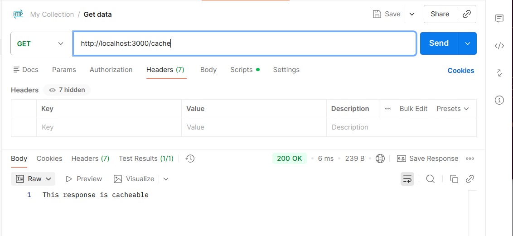

#                                                              HestaBit Learning & Development
#                                                                         Week 1 

# API Investigation Report  
**Tools Used:** cURL, Postman, Node.js
**API Tested:** https://dummyjson.com

**Objective:** To analyze API behavior with respect to pagination, headers, caching, and response handling using command-line and GUI-based tools.

---

## 1. Introduction

This report documents an investigation of a public REST API using command-line and GUI tools. The goal of the experiment was to understand how APIs handle pagination, headers, caching, and response behavior. A small Node.js server was also created to demonstrate common backend features such as header inspection, delayed responses, and cache control.

---

## 2. DNS and Network Analysis

### DNS Lookup

The `nslookup` command was used to resolve `dummyjson.com` to its IP addresses. The domain returned multiple IPs, indicating that the API is hosted behind a Content Delivery Network (CDN).

### Traceroute

Using `traceroute`, the network path from the local machine to the API server was examined. Multiple intermediate hops were observed, with the final hops belonging to CDN edge servers. This confirms that the API uses distributed infrastructure to improve performance and reliability.

---

## 3. API Requests and Pagination

A GET request was made to the products endpoint using `curl` in verbose mode.

The API uses **offset-based pagination**, where:
- `limit` controls the number of records returned
- `skip` controls how many records are ignored from the start

This method is simple and effective for small datasets, but it may become inefficient when dealing with large or frequently changing data.

---

## 4. HTTP Header Experiments

### User-Agent Removal

When the `User-Agent` header was removed, the API still responded with a successful status. This shows that the API does not strictly validate this header.

### Fake Authorization Header

A fake Authorization token was added to the request. The API ignored the header and returned data normally, indicating that the endpoint is publicly accessible and does not require authentication.

### Catching the differences

A public api was used is the process (https://dummyjson.com), therefore no differences were caught ,while performing the header experiments, with User-Agent removal and with Fake Authorization Header.

### Summary

| Scenario | Result |
|--------|-------|
Normal request | Successful |
No User-Agent | Successful |
Fake Authorization | Successful |

---

## 5. Caching and ETag Behavior

The API response included `Cache-Control` and `ETag` headers. The ETag acts as a version identifier for the resource.

When the request was repeated using the `If-None-Match` header with the same ETag value, the server returned a `304 Not Modified` response. This confirms that the API supports HTTP caching, which helps reduce bandwidth usage and improves response times.

---

## 6. Custom Node.js Server

A simple Node.js HTTP server was implemented with the following endpoints:

- `/echo` – Returns request headers for debugging and inspection 
- `/slow?ms=3000` – Delays the response to simulate slow APIs 
- `/cache` – Sends cache-related headers such as `Cache-Control` and `ETag`

These endpoints were tested using Postman to observe headers, response times, and caching behavior.

---

## 7. Testing with Postman

Postman was used to send requests, add custom headers, and inspect responses in a visual environment. It was especially useful for testing delayed responses and verifying cache headers without using the command line.

## 7.1 /echo -> return headers

## 7.2 /slow?ms=3000 -> delay responses by query parameter (3000 ms or 3 sec)

## 7.3 /cache -> return cache headers

---

## 8. Key Takeaways

- APIs depend heavily on HTTP headers for controlling behavior
- Offset-based pagination is easy to implement but has limitations
- ETag-based caching improves performance and reduces unnecessary data transfer
- Public APIs may ignore authentication headers
- Tools like Postman simplify API testing and debugging

---

## 9. Conclusion

This investigation provided hands-on experience with real-world API behavior, HTTP mechanics, and caching strategies. Using cURL, Postman, and a custom Node.js server helped build a practical understanding of how APIs are tested and optimized.

---

