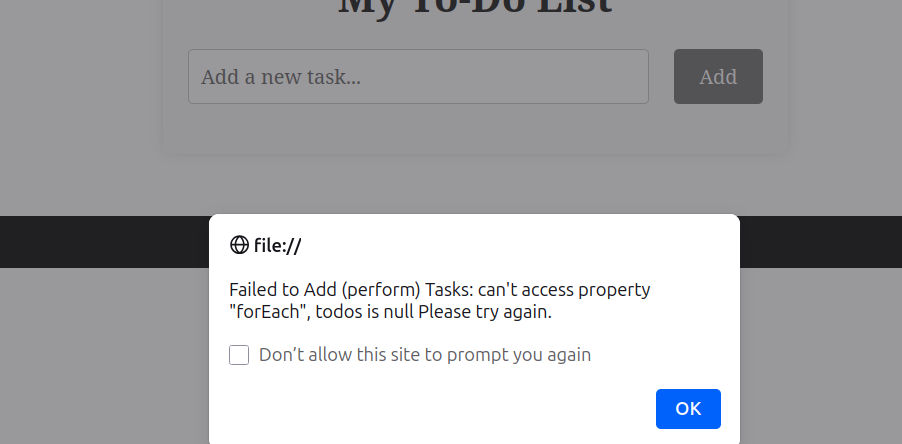
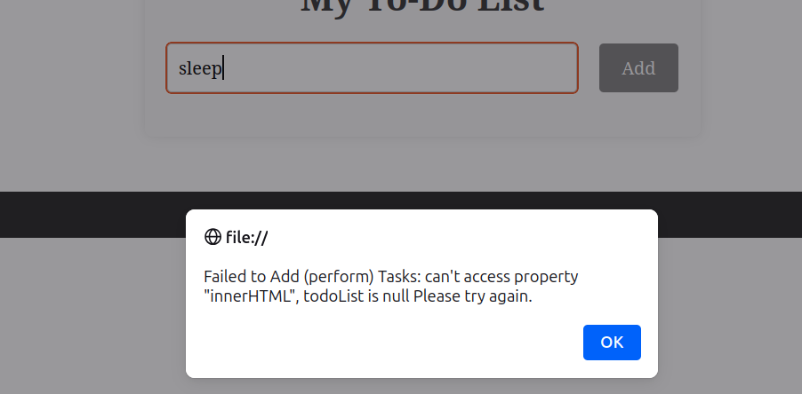

# Application Error Logs

## saveToStorage
- Cause: Invalid key or LocalStorage quota exceeded
- Handling: Error caught and logged
- Impact: App continues running

## loadFromStorage
- Cause: Corrupted JSON
- Handling: Reset to empty array
- Impact: Data loss prevented from crashing UI

## formSubmit
- Cause: Empty todo input
- Handling: Validation + user alert

## renderTodos
- Cause: Invalid todo object structure
- Handling: Error logged, rendering skipped

