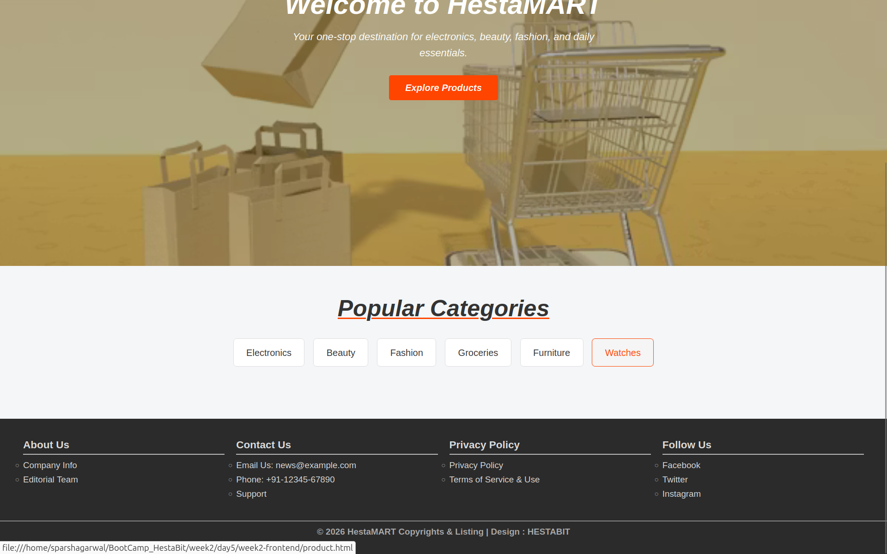
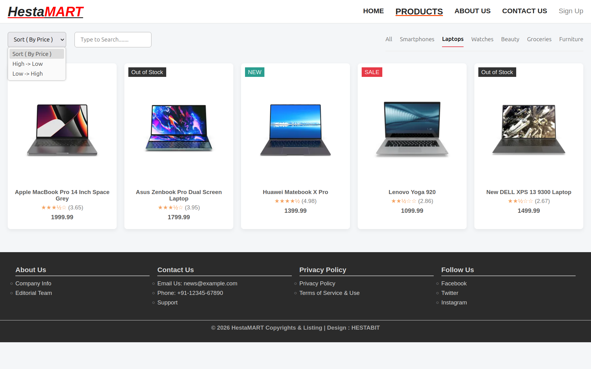

# Week 2 – Day 5  
## Frontend Development Training  
### Mini Project: E-Commerce Product Listing Interface

---

## 1. Introduction

Day 5 of the Week 2 training marked the consolidation of concepts covered throughout the earlier sessions into a single, working frontend application. While previous days focused on individual topics such as layout structuring, responsiveness, DOM manipulation, and debugging, this task required applying those concepts together in a realistic development scenario.

The outcome of this exercise is a functional e-commerce product listing interface that consumes live data, responds to user interactions, and maintains consistency across different devices and user preferences.

---

## 2. Training Objectives

The primary objectives of this activity were:

- To integrate HTML, CSS, and JavaScript into a cohesive user interface
- To apply previously learned DOM manipulation and event handling techniques
- To work with real API data instead of static content
- To implement practical features such as search, filter, and sorting
- To reinforce debugging, error handling, and UI state management concepts

---

## 3. Project Structure and Organization

The project follows a clear and maintainable structure, aligning with best practices discussed earlier in the training:

This structure reflects the **separation of concerns principle**, which was introduced in earlier sessions and consistently applied throughout this task.

---

## 4. Technologies and Concepts Applied

### HTML5 (Semantic Structure)
Semantic HTML elements are used to ensure clear structure, accessibility, and readability. This builds upon earlier exercises where emphasis was placed on meaningful markup rather than visual styling alone.

### CSS3 (Layout and Responsiveness)
Styling is handled using modern CSS techniques such as:
- Flexbox and Grid for layout design
- Media queries for responsive behavior
- CSS variables for theme management

These approaches extend the responsive design principles practiced earlier in the week.

### JavaScript (ES6)
JavaScript is used extensively to manage:
- Dynamic DOM updates
- Event-driven interactions
- Data filtering and sorting logic
- UI state changes

This reinforces prior lessons on DOM traversal, event listeners, and clean function design.

---

## 5. API Integration and Data Flow

Product data is fetched from the following endpoint:

### Data Handling Approach
- The Fetch API is used with `async/await` for readability and error handling
- The fetched dataset is stored locally in memory
- All search, filter, and sort operations are performed on this local dataset
- Rendering is triggered only when the filtered dataset changes

This approach reflects efficient data handling practices introduced during earlier debugging and optimization sessions.

---

## 6. Core Functional Features

### 6.1 Dynamic Product Rendering
Products are displayed dynamically using JavaScript. Each product card includes:
- Thumbnail image
- Product title
- Price
- Rating converted into a star-based representation
- Contextual status badges

This feature demonstrates practical application of array iteration, conditional rendering, and reusable UI logic.

---

### 6.2 Search Functionality
- Real-time search updates as the user types
- Matches against product titles and descriptions
- Case-insensitive comparison improves usability
- Proper feedback is shown when no results are found

This builds directly on earlier exercises involving string manipulation and input-based filtering.

---

### 6.3 Category-Based Filtering
- Popular product categories are provided as quick-access options
- Category selection dynamically updates the product list
- Filters are designed to work alongside search and sorting logic

This reinforces multi-condition filtering techniques and state management concepts.

---

### 6.4 Sorting Logic
- Products can be sorted by price in ascending or descending order
- Sorting is applied after filtering to maintain logical consistency
- Highlights correct usage of JavaScript array methods

---

### 6.5 Responsive Design Implementation
- Layout adapts smoothly to different screen sizes
- Product grids reflow without breaking layout
- Navigation and filter sections remain usable on smaller devices

This directly applies responsive design principles practiced in earlier training days.

---

### 6.6 Theme Toggle and State Persistence
- Users can switch between light and dark themes
- Theme selection is stored using `localStorage`
- The selected theme persists across page reloads

This feature builds upon previous lessons on browser storage and UI state persistence.

---

## 7. Error Handling and Debugging Practices

- API calls are wrapped in `try/catch` blocks
- Fallback messages are displayed when data cannot be loaded
- Defensive checks prevent runtime errors due to missing or undefined properties
- Console logging was used during development to trace logic flow and resolve issues

These practices reflect the debugging methodologies covered earlier in the training.

---

## 8. Learning Outcomes

By completing this task, the following learning outcomes were achieved:

- Improved understanding of how frontend applications consume and manage API data
- Hands-on experience in building interactive and responsive interfaces
- Better grasp of combining multiple UI features without breaking functionality
- Increased confidence in debugging complex interaction logic
- Practical exposure to real-world frontend development workflows

---

## 9. Screenshots

> Final output screenshots of the project

### Home Page

### Product Listing Page

##Product Listing for a specific category of products (laptops)

