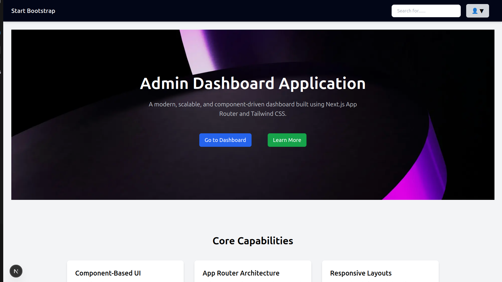
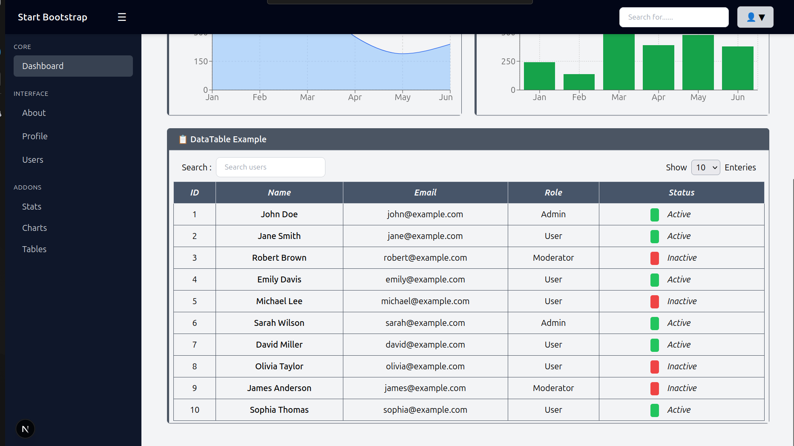
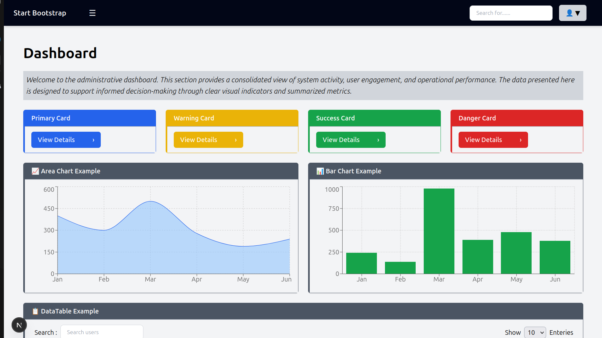
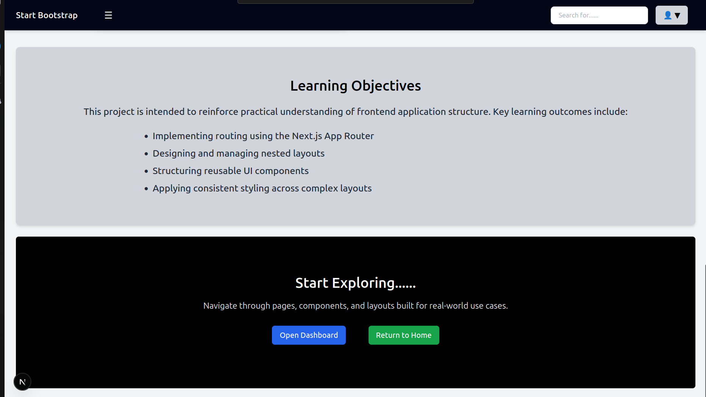
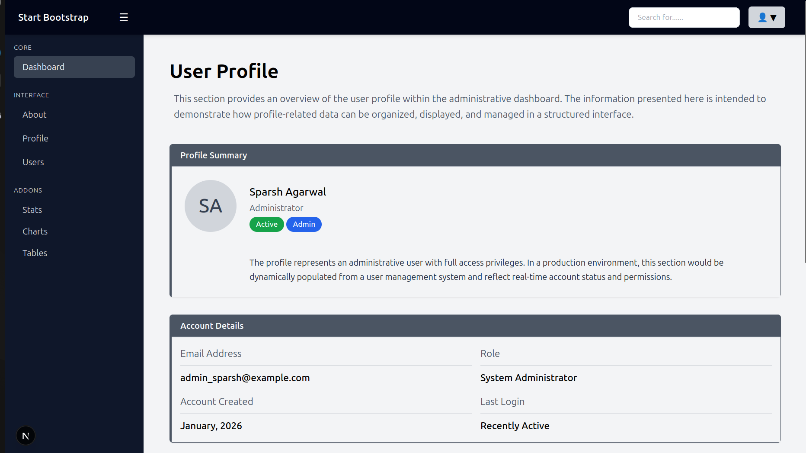
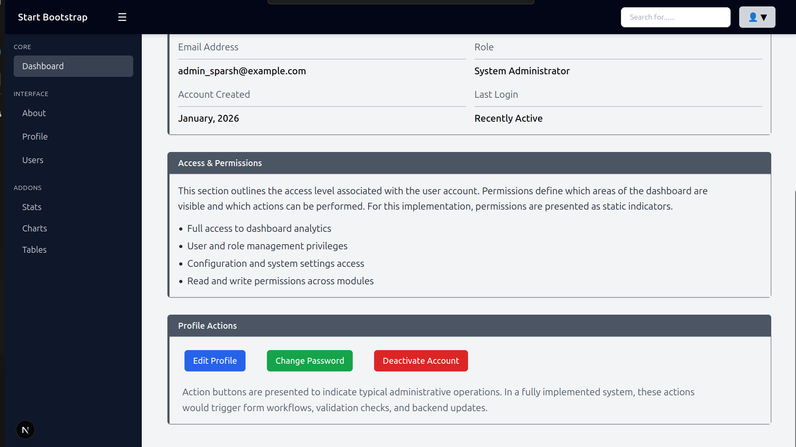
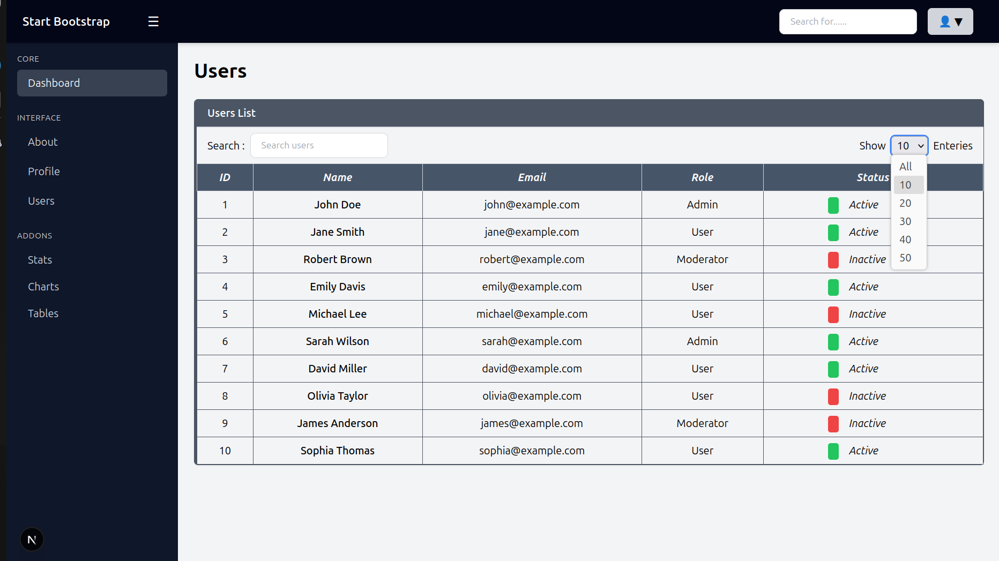

# Week 03 – Training & Project Learning Report

## Overview

Week 03 was dedicated to designing and structuring a **scalable admin dashboard application** using **Next.js (App Router)** and **Tailwind CSS**. The primary focus during this week was on understanding **application architecture**, layout composition, reusable UI components, and state-driven interactions that are commonly implemented in real-world dashboard systems.

This report documents the **concepts studied, lessons learned, daily progress, and project-level understanding** developed throughout the week.

---

## Objectives of Week 03

- Study and implement the **Next.js App Router architecture**
- Design modular and reusable **layouts and UI components**
- Understand dashboard-oriented navigation patterns
- Apply effective **UI state management** techniques
- Maintain styling consistency and responsiveness
- Document learning in an academic and professional manner

---

## Daily Breakdown & Topic Coverage

### Day 1 – Project Setup & App Router Fundamentals

**Topics Covered:**

- Next.js App Router fundamentals
- Folder-based routing system
- Role of `layout.js`, `page.js`, and shared layouts
- Global styling and font configuration

**Learning Lessons:**

- App Router enforces a clear separation between structure and content.
- Layouts help avoid repetition of shared UI elements.
- Understanding rendering boundaries is essential for scalable apps.

**Related Topics:**

- Server vs Client Components
- Global CSS handling

---

### Day 2 – Layout Architecture & Navigation Design

**Topics Covered:**

- Global Navbar design
- Dashboard-specific Sidebar using nested layouts
- Conditional rendering based on routes
- Avoiding layout duplication

**Learning Lessons:**

- Navigation components should be layout-driven, not page-driven.
- Sidebar and Navbar responsibilities must be clearly separated.
- Nested layouts improve maintainability in complex dashboards.

**Related Topics:**

- Layout isolation
- Route-based UI control

---

### Day 3 – State Management & Interactive Behavior

**Topics Covered:**

- Sidebar toggle using `useState`
- Hamburger menu integration
- Dropdown menu behavior in Navbar
- State synchronization across components

**Learning Lessons:**

- UI state must have a single source of truth.
- Incorrect state placement can lead to UI inconsistency.
- Controlled components provide predictable behavior.

**Related Topics:**

- Lifting state up
- Controlled vs uncontrolled components

---

### Day 4 – Dashboard Components & Data Handling

**Topics Covered:**

- Image optimization using `next/image`
- Reusable UI components (Card, Button, Input, Badge, Modal)
- User List table implementation using a dedicated component
- Search, entry selection, and pagination logic
- Component composition and responsibility separation

**Learning Lessons:**

- Data-heavy UI elements should be abstracted into standalone components.
- Separating table logic from page layout improves readability and reuse.
- User experience improves when filtering, pagination, and entry control are colocated.

**Component Focus – `UsersTable.jsx`:**

- Encapsulates table rendering, headers, and row structure
- Manages entry count selection and search filtering UI
- Designed to be reusable across multiple dashboard sections
- Keeps page-level components lightweight and declarative

**Related Topics:**

- Separation of concerns
- Reusable data presentation patterns
- Pagination for moving around the user entries

---

### Day 5 – Media Handling, Styling & UX Refinement

**Topics Covered:**

- Hero section implementation
- Tailwind CSS utilities for spacing and typography
- Responsive layout adjustments

**Learning Lessons:**

- Images must respect container boundaries to avoid layout issues.
- Visual hierarchy improves content clarity.
- Consistent styling improves user experience.

**Related Topics:**

- Responsive design
- Performance optimization

---
## Day 4 and Day 5 were worked together on, mixing the topics covered

## Project Structure Overview

```
app/
├── layout.js          # Root layout (global UI)
├── page.js            # Landing page
├── login/             # Authentication pages
│   └── page.js
├── dashboard/         # Dashboard routes
│   ├── layout.js      # Dashboard-specific layout
│   ├── page.js        # Dashboard home
│   ├── users/         # User management
│   │   └── page.js
│   └── profile/       # Profile pages
│       └── page.js

components/
├── ui/
│   ├── Navbar.jsx
│   ├── Sidebar.jsx
│   ├── Button.jsx
│   ├── Card.jsx
│   ├── Input.jsx
│   ├── Badge.jsx
│   ├── UsersTable.jsx
│   └── Modal.jsx
|    

styles/
└── globals.css
```

**Structure Explanation:**

- Routing is organized by feature rather than by file type.
- UI components are centralized for reuse and consistency.
- Layouts encapsulate navigation logic and shared UI.

---

## Component Architecture & Usage

### Layout Components

- **Navbar:** Global navigation and user interactions
- **Sidebar:** Dashboard navigation and route grouping

### UI Components

- **Button:** Action triggers with variants
- **Card:** Content grouping and data display
- **Input:** Search and form inputs
- **Badge:** Status and role indicators
- **Modal:** Confirmation and focused user actions
- **UsersTable:** Centralized user data presentation with search, pagination, and entry controls
- **Navbar:** Centralized navigation bar for the dashboard application
- **Sidebar:** Sidebar , a controller / navigator among the dashboard application , providing specific routing option/menu to work on the application.

### Page Components

- Responsible for composing layouts and components with data.
- Allows better re-usability of code and maintain the scalability/flexibility of the application.
- It improves consistency, efficiency and simplified maintenance.
---

## Key Concepts & Learning Summary

- Layout architecture defines scalability.
- State-driven UI ensures predictable behavior.
- Reusable components reduce duplication.
- Navigation patterns should align with user expectations.
- Performance and UX must be considered together.

---

## Challenges Faced & Solutions

- **Sidebar duplication issue:** Resolved by isolating dashboard layout.
- **Sidebar Visibility issue (using hamburger button):** Resolved using the "useState" hook, to optimize, render and visibility of the sidebar.
- **Image overflow issues:** Solved using proper container control and `next/image` usage.
- **State inconsistency:** Fixed by lifting state to appropriate layout level.
- **Multiple use-case of components:** Fixed by using the ...props (declaring variants) for each use-case (diff. types/needs) of components.
---

## Screenshots of the application (complete)

### Landing Page




### Dashboard Page




#### Dashboard Page without Sidebar (Using Hamburger Button)


### About Page




### User Profile Page




### User List Page

## Conclusion

Week 03 strengthened the understanding of **modern frontend architecture** and dashboard-oriented design. The concepts learned during this week—layouts, state management, component reuse, and UX patterns—form a solid foundation for advanced features and future development phases.

