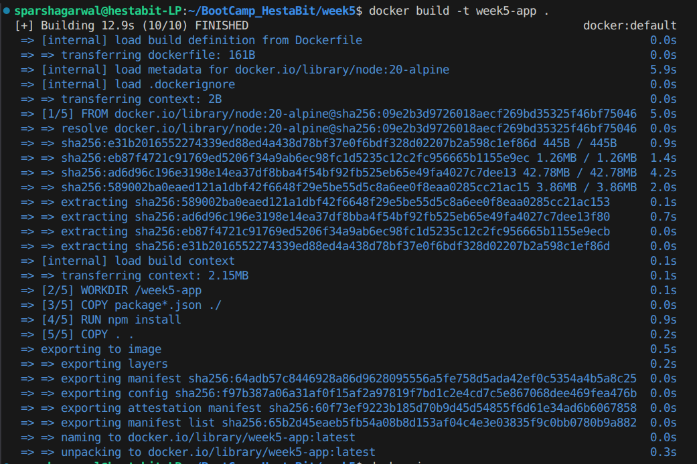
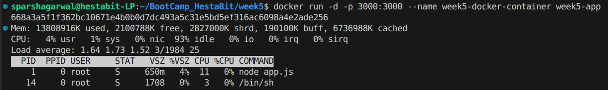
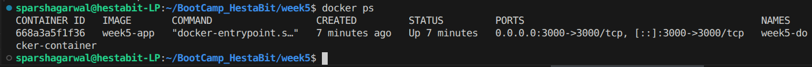
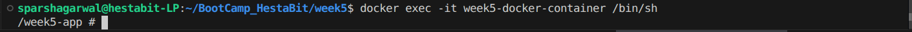
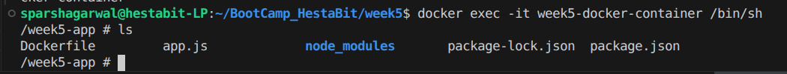
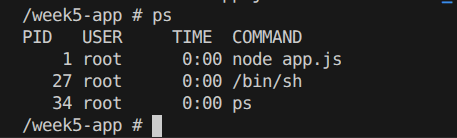
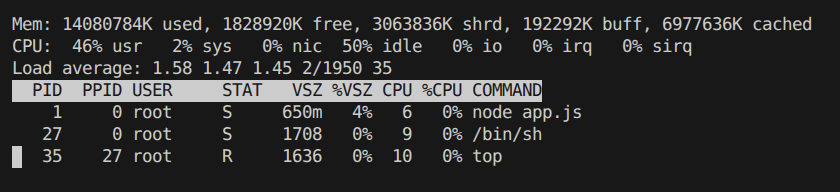
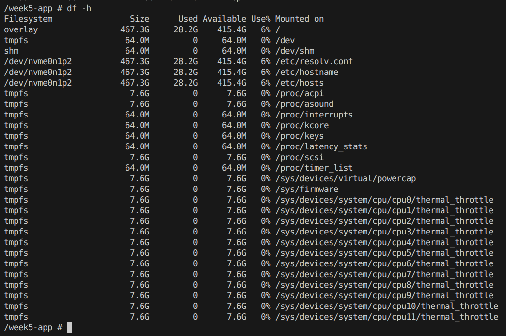
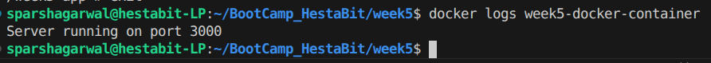

# Week 5 — Day 1

### Docker Fundamentals & Linux Exploration Inside Containers

---

## Objective

Day 1 focused on:

* Understanding Docker images and containers
* Writing a production-style Dockerfile
* Running a Node.js container
* Entering the container shell
* Exploring Linux environment inside a running container
* Observing processes, filesystem, disk usage, and logs

This session emphasized **practical container inspection**.

---

## Dockerfile – Node Application

```
FROM node:20-alpine

WORKDIR /week5-app

COPY package*.json ./
RUN npm install

COPY . .

EXPOSE 3000

CMD ["node", "index.js"]
```

### Why This Structure?

* `node:20-alpine` → Lightweight production-ready base image
* `WORKDIR` → Clean application structure
* `npm ci --omit=dev` → Deterministic, production install
* `EXPOSE` → Documents container port

---

### Build Docker Image

```
docker build -t week5-day1-node .
```



---

### Run Container

```
docker run -d -p 3000:3000 --name week5-day1 week5-day1-node
```



---

### Verify Running Container

```
docker ps
```

Purpose:

* Confirm container status
* Check port mapping
* Verify container name



---

## Enter Container Shell (Like SSH)

```
docker exec -it week5-day1 /bin/sh
```

This provides direct shell access inside the container.



---

## Explore Filesystem Inside Container

### List Files

```
ls
```

Observation:

* Alpine-based minimal Linux environment
* Standard Linux directory structure





## Inspect Running Processes

### Show Running Processes

```
ps
```

Observation:

* Node runs as PID 1
* Container lifecycle tied to main process



---

### Monitor System Resources

```
top
```

Purpose:

* Observe CPU and memory usage
* Identify active processes



---

## Inspect Disk Usage

### Filesystem Usage

```
df -h
```



---

## View Container Logs (Outside Container)

Exit shell:

```
exit
```


---

View logs:

```
docker logs week5-day1
```

Purpose:

* Inspect runtime output
* Debug application behavior


