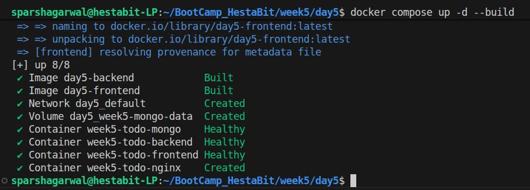
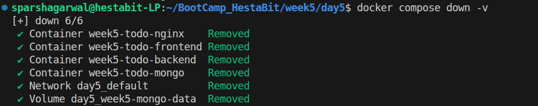
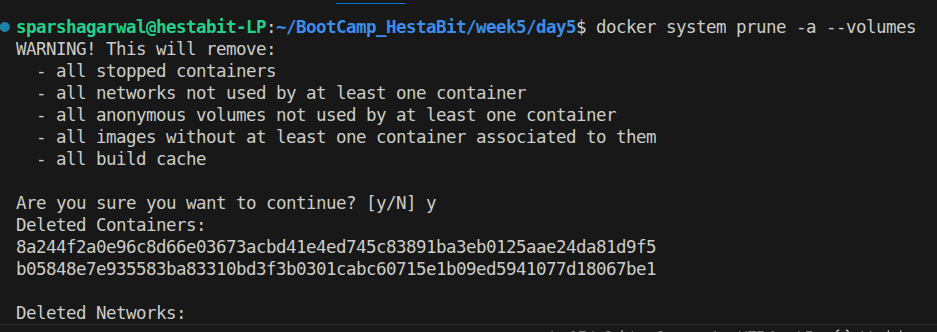
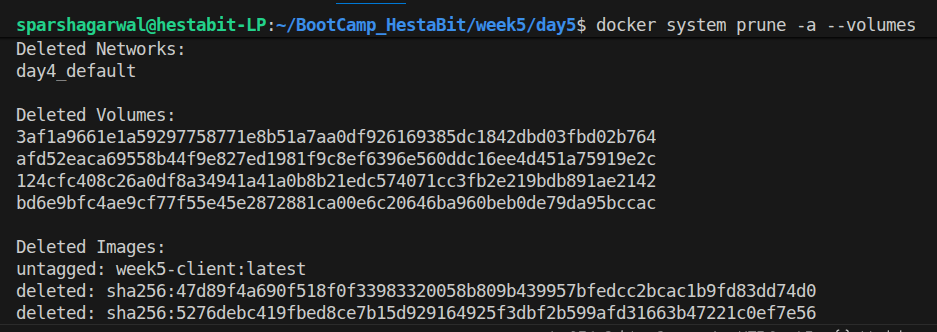
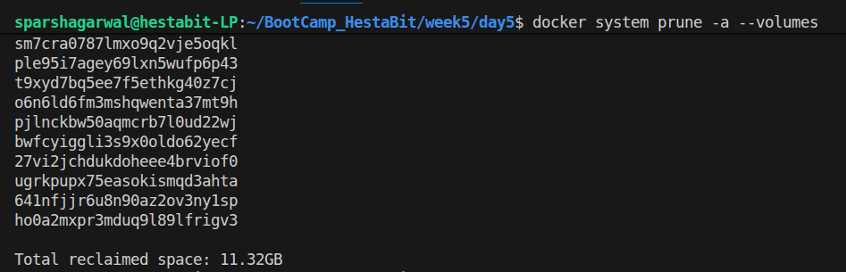

# Production Deployment Guide

## Dockerized To-Do Application

---

## 1. Introduction

This document outlines how the To-Do application is structured and deployed in a production-oriented environment using Docker.

Although the application itself is relatively simple, the deployment setup emphasizes containerization, service isolation, HTTPS configuration, reverse proxy routing, and persistent storage — all of which reflect real-world production standards.

The objective is not merely to run the application, but to deploy it in a way that aligns with modern infrastructure and deployment best practices.

---

## 2. Technology Stack

* **Frontend:** Next.js (Production Build)
* **Backend:** Node.js + Express
* **Database:** MongoDB
* **Reverse Proxy:** Nginx
* **Container Orchestration:** Docker Compose
* **TLS Certificates:** mkcert (locally trusted HTTPS)
* **Persistent Storage:** Docker Named Volumes

The primary focus of this setup lies in infrastructure and deployment practices rather than application-level implementation.

---

## 3. System Architecture

All services run within isolated Docker containers and communicate over Docker’s internal network.

### Request Flow

```
Client (Browser - HTTPS)
        ↓
       Nginx (Reverse Proxy)
        ↓
 ┌─────────────────────────┐
 │ Frontend  (Next.js)     │
 │ Backend   (Express API) │
 │ MongoDB   (Database)    │
 └─────────────────────────┘
```

Nginx serves as the single entry point. Every incoming request first reaches Nginx, which then routes it to the appropriate internal service.

---

### Architecture Diagram Placeholder

```
> Insert System Architecture Diagram Here
> (Browser → Nginx → Frontend / Backend → MongoDB)
```
---

## 4. Dockerized Services

All services are defined inside `docker-compose.prod.yml`.

Each component operates within its own container:

* `frontend`
* `backend`
* `mongo`
* `nginx`

Docker automatically provisions a shared internal network that allows containers to communicate using service names.

### Important Networking Principle

Within a container:

* `localhost` refers to the container itself
* Inter-service communication must use Docker service names

Correct example:

```
mongodb://mongo:27017/tododb
```

Incorrect example:

```
mongodb://localhost:27017
```

Understanding this distinction is essential when working in containerized environments.

---

## 5. Reverse Proxy & HTTPS

Nginx manages all incoming traffic to the system.

### Responsibilities of Nginx

* Handles HTTPS termination
* Routes traffic to appropriate services
* Proxies API requests
* Prevents direct exposure of internal services

### Routing Strategy

| Route    | Destination |
| -------- | ----------- |
| `/`      | Frontend    |
| `/api/*` | Backend     |

Only Nginx exposes port `443` to the host machine.
The backend and database remain accessible only within the Docker network.

---

### Reverse Proxy Diagram Placeholder

```
> Insert Nginx Routing Diagram Here
> (HTTPS → Nginx → / → Frontend | /api → Backend)
```
---

## 6. HTTPS Configuration (mkcert)

To simulate a production-like HTTPS environment locally:

* mkcert is used to generate trusted local certificates
* Certificates are mounted into the Nginx container
* HTTPS is enforced for all browser communication

This setup prevents mixed-content issues and ensures secure communication behavior consistent with real production deployments.

---

## 7. Persistent Database Storage

MongoDB uses a Docker named volume:

```
volumes:
  mongo-data:

```

Mounted at:

```
/data/db
```

### Why This Is Important

Without a volume:

* Data would be lost whenever the container is removed.

With a volume:

* Data persists across container restarts and rebuilds.

This approach mirrors how persistent storage is handled in real-world production systems.

---

## 8. Healthchecks & Startup Order

Docker healthchecks are implemented to ensure services initialize in the correct order.

Example:

```
depends_on:
  backend:
    condition: service_healthy
```

This prevents scenarios where dependent services attempt to start before their dependencies are fully ready, reducing startup-related failures.

---

## 9. Production-Oriented Docker Practices

The following best practices were applied:

### Backend

* Uses a lightweight base image
* Installs only production dependencies
* Includes a `.dockerignore` file
* Externalizes environment variables

### Frontend

* Implements a multi-stage Docker build
* Produces an optimized production build
* Excludes development dependencies from runtime

### Security Considerations

* Only Nginx is publicly accessible
* Backend and MongoDB remain internal
* No credentials are hardcoded
* `.env` files are excluded from version control

---

## 10. Environment Configuration

Application configuration is managed through environment variables:

```
MONGO_URI
PORT
```

Injected via:

```
env_file:
  - .env
```

Separating configuration from application code ensures flexibility and portability across environments.

---

## 11. Deployment Commands

### Build and Start

```
docker-compose up -d --build
```


### Stop Containers

```
docker-compose down
```

#### Remove Containers and Volumes

```
docker-compose down -v
```


### Clean Unused Docker Resources

```
docker system prune -a --volumes
```






---

## 12. Exposure Model

| Component | Public Access | Internal Only |
| --------- | ------------- | ------------- |
| Nginx     | Yes           | —             |
| Frontend  | No            | Yes           |
| Backend   | No            | Yes           |
| MongoDB   | No            | Yes           |

Only the reverse proxy is publicly exposed, following common production deployment standards.

---

## 13. Real Production Considerations

In a real-world deployment, additional enhancements would typically include:

* Managed database services (e.g., MongoDB Atlas)
* Centralized logging and monitoring
* CI/CD pipelines
* Automatic container restart policies
* Horizontal scaling strategies
* Secure secret management

---

