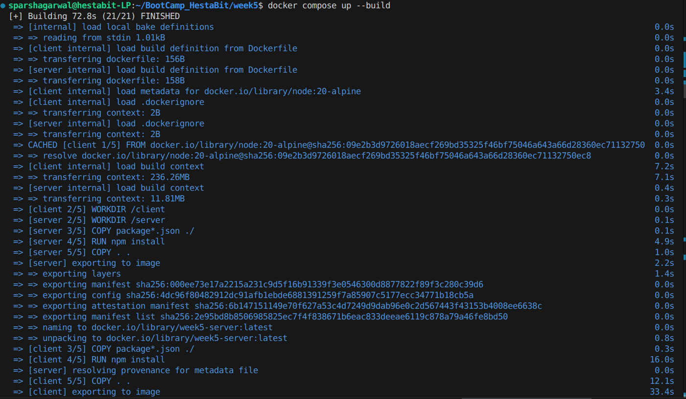
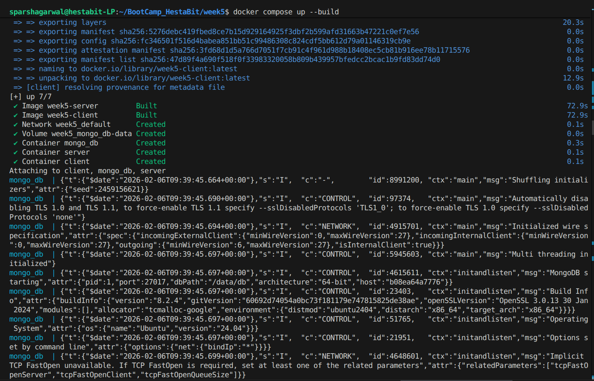
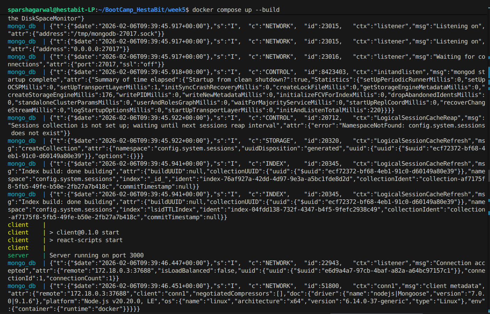
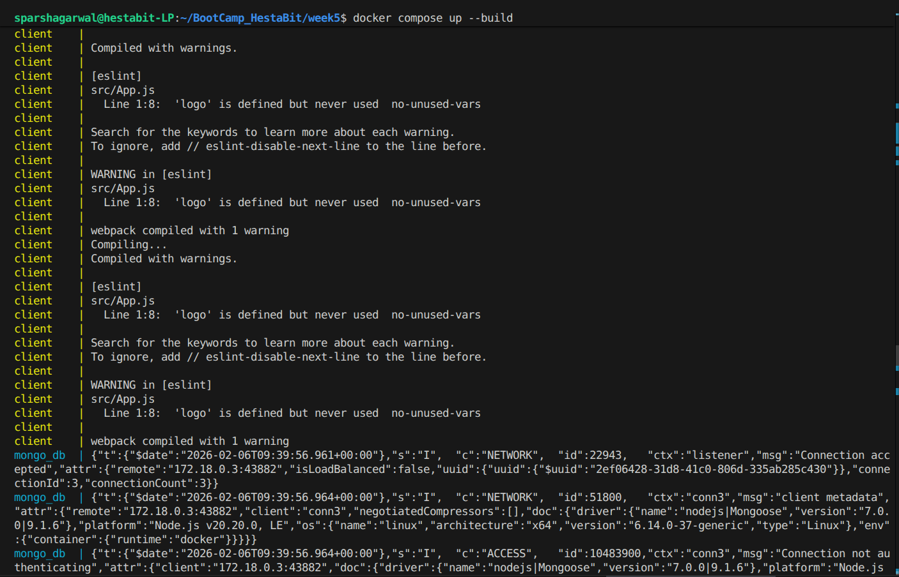
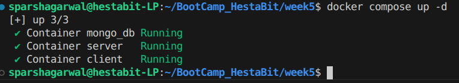
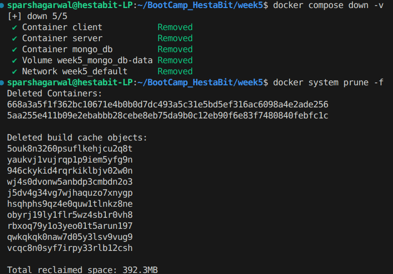
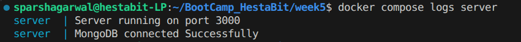
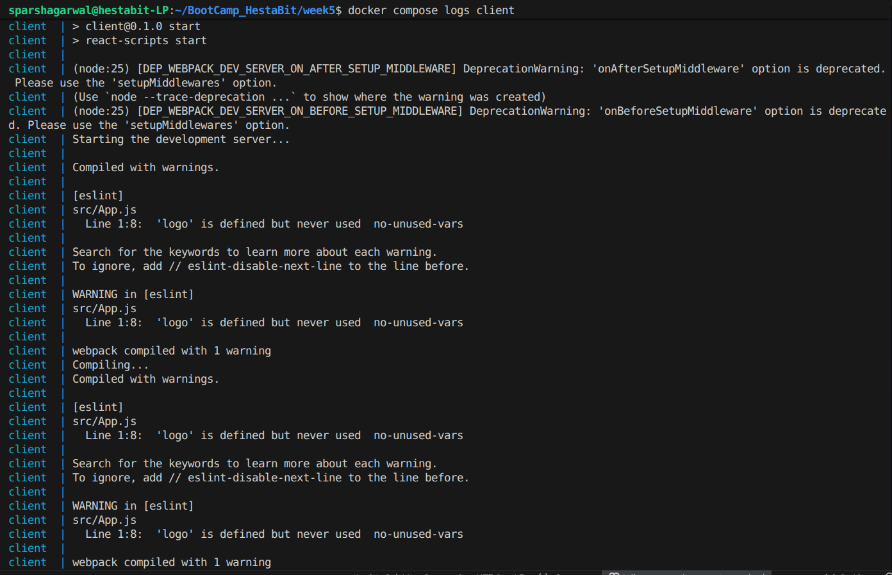
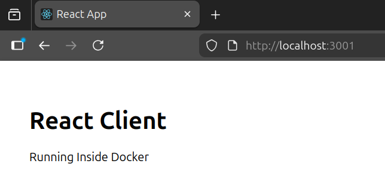
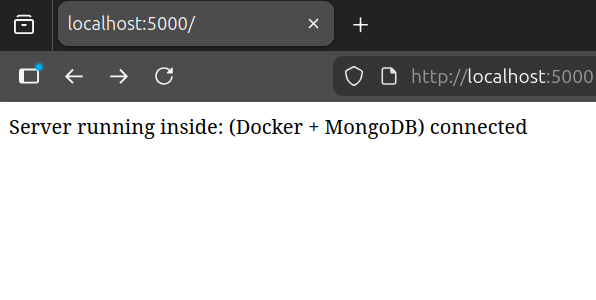

# Week 5 — Day 2

### Docker Compose & Multi-Container Application Deployment

---

## Objective

Day 2 focused on orchestrating a **multi-container full-stack application** using Docker Compose.

The goal was to:

* Understand Docker networking between containers
* Implement persistent storage using volumes
* Deploy multiple services using a single command
* Validate container communication
* Inspect logs and service health

This session emphasized **service orchestration and inter-container communication**.

---

## Architecture Overview

Full-stack deployment includes:

* **Client** → React (Frontend)
* **Server** → Node.js + Express (Backend)
* **Database** → MongoDB
* **Network** → Docker bridge network (auto-created by Compose)
* **Volume** → Persistent MongoDB storage

---

## Docker Compose Configuration

### docker-compose.yml

```
services:
  mongo:
    image: mongo:latest
    container_name: mongo_db
    volumes:
      - mongo_db-data:/data/db

  server:
    build: ./server
    container_name: server
    ports:
      - "5000:3000"
    environment:
      MONGO_URI: mongodb://mongo_db:27017/week5_db
    depends_on:
      - mongo

  client:
    build: ./client
    container_name: client
    ports:
      - "3001:3000"
    depends_on:
      - server

volumes:
  mongo_db-data:

```

---

### Why This Structure?

* Service names act as internal DNS hosts (`mongo`)
* No need for localhost inside containers
* Volume ensures database persistence
* `depends_on` ensures startup order
* Single command deployment

---

## Deploy the Entire Stack

### Build Services

```
docker compose up --build
```

This command:

* Builds images
* Creates network
* Creates volume










### Start Services
```
docker compose up -d
```
This command:

* Starts all services in detached mode



---

### Verify Running Containers

```
docker compose ps
```

Purpose:

* Confirm all services are running
* Verify exposed ports
* Check container status

---

## Docker Networking (Container Communication)

### Inspect Network

```
docker network ls
```

---

```
docker network inspect <project_name>_default
```

Observation:

* All services share same bridge network
* Internal DNS resolution enabled
* Containers can reach each other using service names

---

### MongoDB Connection Validation

Inside backend container:

```
docker exec -it <server_container> /bin/sh
```

---

Verify environment variable:

```
echo $MONGO_URI
```

Expected:

```
mongodb://mongo:27017/week5
```

---

## Volume Persistence

### List Volumes

```
docker volume ls
```

---

### Inspect Volume

```
docker volume inspect mongo_data
```

Observation:

* Volume mount point
* Persistence beyond container lifecycle

---

### Test Persistence

Stop containers:

```
docker compose down -v
```

Complete delete, empyting/ deleting every image, containers, etc. (everything) of docker. ( ONLY IF NEEDED).

```
docker system prune -f
```


---

Restart:

```bash
docker compose up -d
```

Data remains intact because of named volume, only if not deleted or stopped.

---

## Logs Verification

### View All Logs

```
docker compose logs
```

---

### View Specific Service Logs

```
docker compose logs server
```



---

```
docker compose logs client
```



---

## Service Validation

### Frontend

Open browser:

```
http://localhost:3000
```



---

### Backend API

```
http://localhost:5000
```



---

### Key Technical Learnings

* Docker Compose simplifies multi-container deployment
* Service names replace localhost in container networking
* Volumes enable persistent data storage
* Bridge network is auto-created per project
* Logs can be aggregated per service

---
