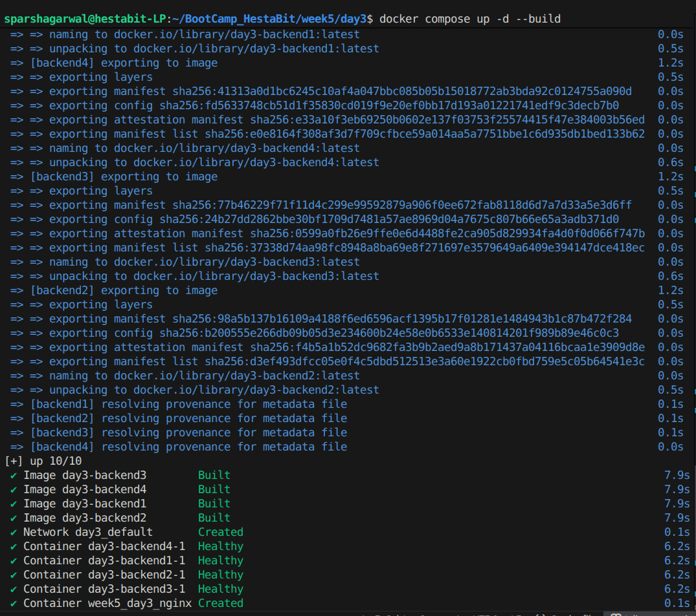
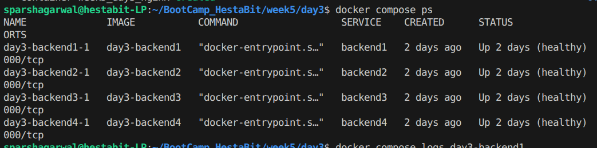
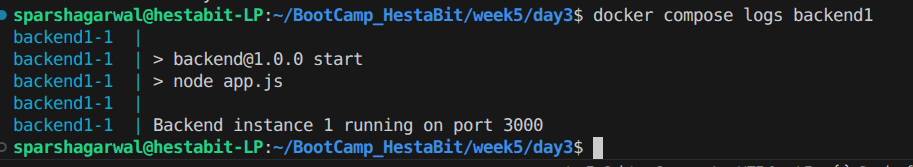

# Week 5 — Day 3

### NGINX Reverse Proxy & Load Balancing (Docker-Based Setup)

---

## Objective

Day 3 focused on introducing a **reverse proxy layer** using NGINX inside Docker.

The goal was to:

* Deploy NGINX as a containerized reverse proxy
* Route incoming traffic to internal backend containers
* Simulate load balancing using multiple backend instances
* Enable round-robin distribution
* Validate traffic flow across replicas

This session emphasized **traffic control and container-level load balancing**.

---

## Architecture Overview

Application Stack:

* **NGINX** → Reverse Proxy
* **Backend Replica 1** → Node.js
* **Backend Replica 2** → Node.js
* **Docker Network** → Internal service communication

Traffic Flow:

```
Client → NGINX → Backend Replicas
```

NGINX routes:

```
/api → backend-service:3000
```

---

## NGINX Configuration

### nginx.conf

```
events {}

http {
    upstream backend {
        server backend1: 3000;
        server backend2: 3000;
        server backend3: 3000;
        server backend4: 3000;
    }

    server {
        listen 80;

        location /api {
            proxy_pass http://backend_service;
        }
    }
}
```

---

### Configuration Explanation

* `upstream backend_service` defines backend pool
* Two backend containers registered
* Default NGINX strategy = **round-robin**
* `proxy_pass` forwards traffic internally
* Headers preserve client information

---

## Docker Compose Setup

### docker-compose.yml (Relevant Structure)

```
services:
  backend1:
    build: ./backend
    environment:
      - INSTANCE_ID=1
    expose:
      - "3000"
    healthcheck:
      test: [ "CMD", "curl", "-f", "http://localhost:3000/api" ]
      interval: 5s
      retries: 5
      timeout: 3s
      start_period: 3s

  backend2:
    build: ./backend
    environment:
      - INSTANCE_ID=2
    expose:
      - "3000"
    healthcheck:
      test: [ "CMD", "curl", "-f", "http://localhost:3000/api" ]
      interval: 5s
      retries: 5
      timeout: 3s
      start_period: 3s

  backend3:
    build: ./backend
    environment:
      - INSTANCE_ID=3
    expose:
      - "3000"
    healthcheck:
      test: [ "CMD", "curl", "-f", "http://localhost:3000/api" ]
      interval: 5s
      retries: 5
      timeout: 3s
      start_period: 3s

  backend4:
    build: ./backend
    environment:
      - INSTANCE_ID=4
    expose:
      - "3000"
    healthcheck:
      test: [ "CMD", "curl", "-f", "http://localhost:3000/api" ]
      interval: 5s
      retries: 5
      timeout: 3s
      start_period: 3s

  nginx:
    image: nginx:alpine
    container_name: week5_day3_nginx
    ports:
      - "8080:80"
    volumes:
      - ./nginx/nginx.conf:/etc/nginx/nginx.conf:ro
    depends_on:
      backend1:
        condition: service_healthy
      backend2:
        condition: service_healthy
      backend3:
        condition: service_healthy
      backend4:
        condition: service_healthy

```

---

## Deploy the Stack

### Build & Start Containers

```
docker compose up -d --build
```

This command:

* Builds backend image
* Starts two backend containers
* Launches NGINX
* Creates shared network automatically



---

## Verify Running Containers

```
docker compose ps
```

Purpose:

* Ensure all three containers are running
* Confirm port mapping (8080 → 80)



---

## Verify Reverse Proxy Routing

Open browser:

```
http://localhost:8080/api
```

---

## Confirm Load Balancing (Round Robin)

To verify traffic distribution:

1. Add a unique identifier inside each backend container (e.g., container hostname).
2. Refresh endpoint multiple times.

Example backend response:

```
res.json({
  server: process.env.HOSTNAME
});
```

Refresh multiple times:

* backend1
* backend2
* backend1
* backend2

Traffic alternates automatically.

---

## Inspect Internal Docker Network

```
docker network ls
```

---

Inspect project network:

```
docker network inspect <project_name>_default
```

Observation:

* NGINX and backends share same network
* Service names resolve via Docker DNS

---

## Inspect NGINX Logs

```
docker logs reverse-proxy
```

---

## Backend Logs Verification

```
docker logs backend1
```

```
docker logs backend2
```

Purpose:

* Confirm requests reaching different containers
* Observe traffic alternation



---

### Key Technical Observations

* NGINX acts as a traffic gateway
* Backend containers are not exposed publicly
* Internal service discovery via container names
* Default NGINX strategy = round-robin
* Load balancing works without additional configuration

---

### Production Perspective

This setup mirrors real-world production architecture:

* Reverse proxy handles public traffic
* Application containers stay internal
* Horizontal scaling achieved via replicas
* Traffic distribution improves availability
* Foundation for HTTPS, rate limiting, caching

This architecture becomes the base for:

* SSL termination
* Production-grade scaling
* Zero-downtime deployments

---
