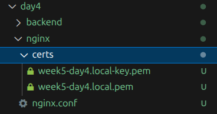
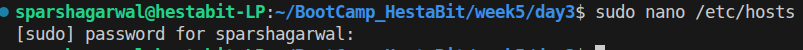
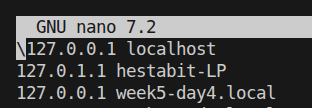
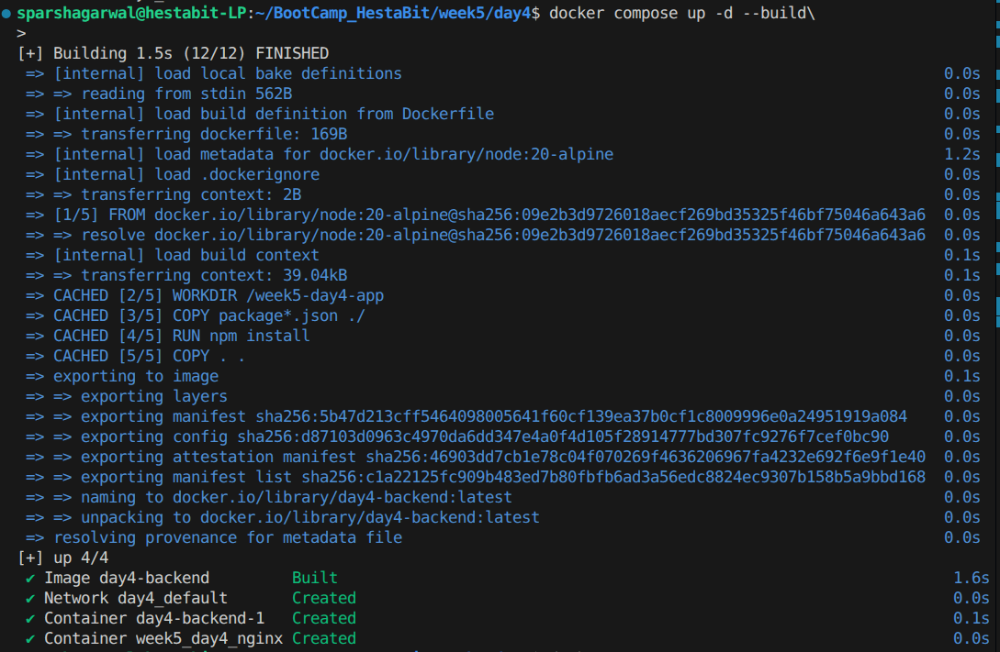
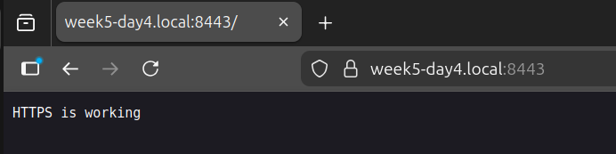
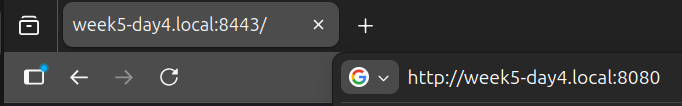

# Week 5 — Day 4

### SSL, mkcert & HTTPS with NGINX (Docker Setup)

---

## Objective

Day 4 focused on securing the application using HTTPS.

The goal was to:

* Understand SSL/TLS basics in a practical way
* Generate local development certificates using mkcert
* Configure NGINX to terminate HTTPS
* Force HTTP → HTTPS redirection
* Confirm secure browser connection (lock icon)

This session emphasized **secure traffic handling inside a containerized environment**.

---

## What We Implemented

* Self-signed local CA using mkcert
* Trusted certificate for custom local domain
* HTTPS termination at NGINX
* HTTP redirected to HTTPS automatically
* Verified secure connection in browser

---

## Step 1 — Install mkcert (Local CA Tool)

mkcert allows creation of locally trusted certificates without browser warnings.

Install mkcert:

```
sudo apt install mkcert
```

Install local CA:

```
mkcert -install
```

---

## Step 2 — Generate Local SSL Certificate

Generate certificate for local domain:

```
mkcert week5-day4.local
```

This creates:

* `week5-day4.local.pem`
* `week5-day4.local-key.pem`



---

## Step 3 — Update /etc/hosts

Map local domain to localhost:

```
sudo nano /etc/hosts
```



Add:

```
127.0.0.1 week5-day4.local
```



---

## Step 4 — Configure NGINX for HTTPS

### nginx.conf

```
events {}

http {
    upstream backend_service {
        server backend:3000;
    }

    server{
        listen 80;
        server_name week5-day4.local;

        return 301 https://$host:8443$request_uri;
    }

    server {
        listen 443 ssl;
        server_name week5-day4.local;

        ssl_certificate /etc/nginx/certs/week5-day4.local.pem;
        ssl_certificate_key /etc/nginx/certs/week5-day4.local-key.pem;  

        # Good TLS defaults (safe + simple)
        ssl_protocols TLSv1.2 TLSv1.3;
        ssl_prefer_server_ciphers on;

        location /api {
            proxy_pass http://backend_service;
            proxy_set_header Host $host;
            proxy_set_header X-Forwarded-Proto https;
            proxy_set_header X-Real-IP $remote_addr;
        }

        location / {
            return 200 "HTTPS is working \n";
        }
    }
}
```

---

### What This Configuration Does

* Port 80 → redirects to HTTPS
* Port 443 → handles encrypted traffic
* SSL termination happens at NGINX
* Backend remains internal and HTTP

---

## Step 5 — Mount Certificates in Docker

docker-compose.yml snippet:

```
services:
  backend:
    build: ./backend
    expose:
      - "3000"

  nginx:
    image: nginx:alpine
    container_name: week5_day4_nginx
    ports:
      - "8080:80"
      - "8443:443" 
    volumes:
      - ./nginx/nginx.conf:/etc/nginx/nginx.conf:ro
      - ./nginx/certs:/etc/nginx/certs:ro
    depends_on:
      - backend
```

---

## Step 6 — Deploy Secure Stack

```
docker compose up -d --build
```



---

## Step 7 — Verify HTTPS

Open browser:

```
https://week5-day4.local:8443
```

Expected result:

* Browser shows secure lock icon
* No security warnings
* Traffic encrypted



---

## Confirm HTTP Redirect

Visit:

```
http://week5-day4.local:8080
```

It should automatically redirect to:

```
https://week5-day4.local:8443
```



---

# Validate Certificate

Click lock icon → View certificate details.

Confirm:

* Issued by mkcert local CA
* Valid for week5-day4.local
* Trusted

---

## Inspect NGINX Logs

```
docker logs <nginx-container-name>
```

---

### Technical Observations

* SSL termination handled at reverse proxy
* Backend remains untouched and internal
* mkcert avoids browser warnings
* HTTPS enforced through redirect
* Containers remain isolated

---

### Production Perspective

This implementation reflects real-world practices:

* Reverse proxy handles TLS
* Internal services remain private
* Redirects enforce secure traffic
* Certificates mounted securely inside container

In production:

* Replace mkcert with Let's Encrypt
* Automate renewal
* Enable HTTP/2
* Add strict security headers

---
