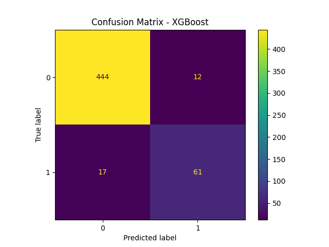

                                Hestabit Training Development
                                        Week 6 – Day 3


## Model Comparison and Best Model Selection


## Objective

The goal of this exercise was to:

* Train multiple classification models for churn prediction
* Handle class imbalance appropriately
* Compare models using cross-validation
* Select the most suitable model based on evaluation metrics

---

## Experimental Setup

### Dataset

Preprocessed and feature-selected training and test datasets were used:

* `X_train_selected.npy`
* `X_test_selected.npy`
* `y_train.npy`
* `y_test.npy`

### Target Variable

The problem is a ***binary classification task***, where:

```
 0 → Customer did not churn
 1 → Customer churned
```
---

## Handling Class Imbalance

The churn dataset was not evenly distributed between classes. Since this can bias models toward the majority class, imbalance handling was necessary.

To ensure fair model comparison:

* SMOTE was applied within the training pipeline.
* Stratified 5-Fold Cross-Validation was used.
* ROC-AUC was chosen as the primary selection metric.

This approach ensured:

* No data leakage
* Balanced fold distributions
* Reliable model evaluation

---

## Models Compared

The following models were evaluated:

1. Logistic Regression
2. Random Forest
3. XGBoost
4. Neural Network (MLP)

Each model was evaluated using:

* Accuracy
* Precision
* Recall
* F1 Score
* ROC-AUC

---

## Cross-Validation Performance

| Model               | Accuracy | Precision | Recall | F1 Score | ROC-AUC |
| ------------------- | -------- | --------- | ------ | -------- | ------- |
| Logistic Regression | 0.77     | 0.36      | 0.72   | 0.48     | 0.81    |
| Random Forest       | 0.95     | 0.84      | 0.84   | 0.84     | 0.91    |
| XGBoost             | 0.95     | 0.83      | 0.86   | 0.84     | 0.92    |
| Neural Network      | 0.88     | 0.60      | 0.56   | 0.58     | 0.82    |

---

## Comparative Analysis

### Logistic Regression

* Strong recall
* Lower precision
* Limited by linear decision boundary

### Random Forest

* High accuracy
* Balanced precision and recall
* Strong ensemble performance

### XGBoost

* Highest ROC-AUC
* Strong generalization
* Balanced classification metrics
* Best churn discrimination capability

### Neural Network

* Moderate performance
* Slightly lower recall compared to tree-based models

---

## Best Model Selection

Based on ROC-AUC (primary metric):

**Selected Model: XGBoost**

Reasons for selection:

* Highest ROC-AUC score
* Balanced precision and recall
* Strong F1 Score
* Robust performance across folds

---

## 8. Final Test Evaluation

| Metric    | Value |
| --------- | ----- |
| Accuracy  | 0.94  |
| Precision | 0.83  |
| Recall    | 0.78  |
| F1 Score  | 0.80  |
| ROC-AUC   | 0.87  |

These results confirm that the selected model generalizes well to unseen data.

---

## Confusion Matrix



---

## Conclusion

This comparative study demonstrates that ensemble tree-based models outperform linear and neural approaches for churn prediction on this dataset.

Among all evaluated models, XGBoost achieved the most balanced and robust performance, making it the optimal choice for deployment.

---
