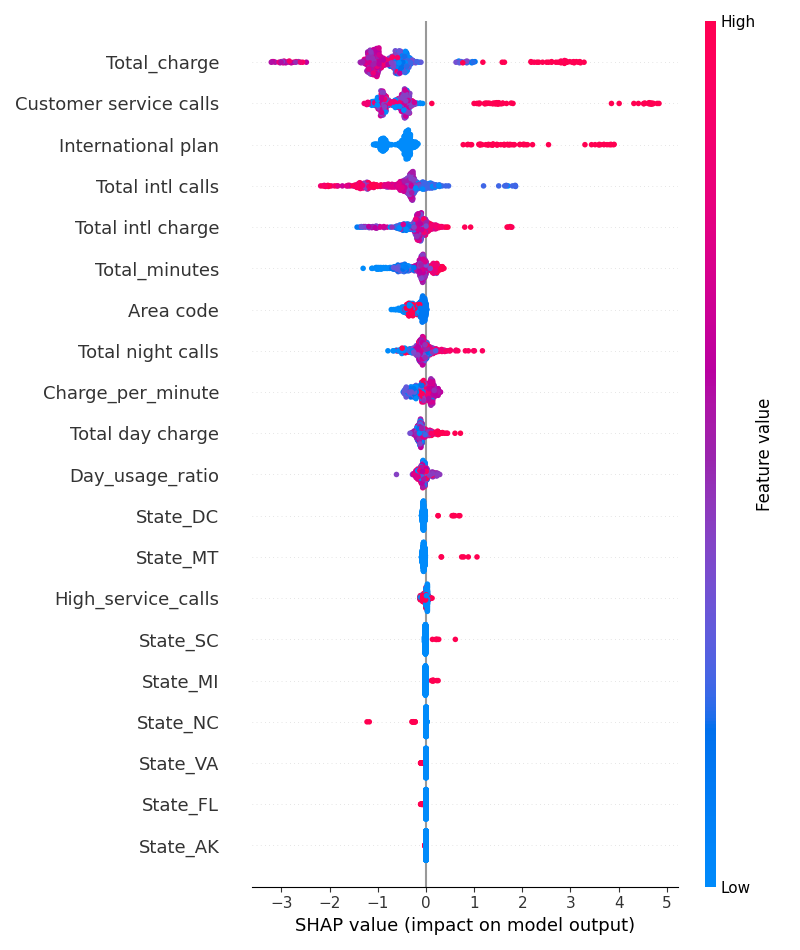
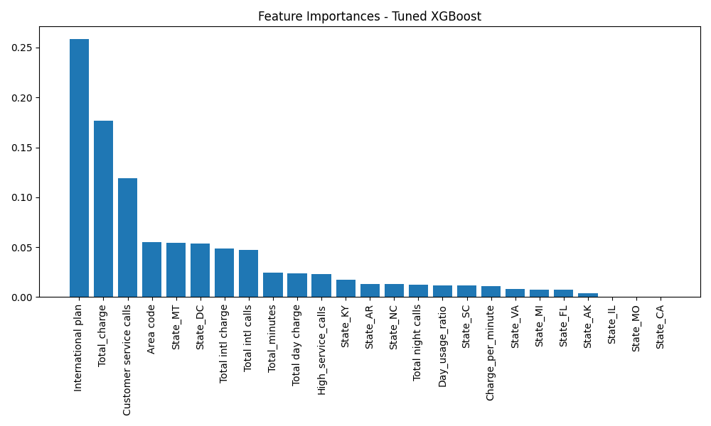
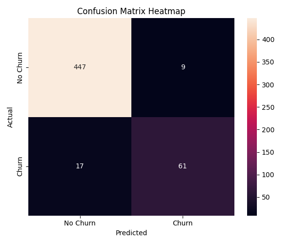

                                Hestabit Training Development
                                    Week 6 — Day 4


## Hyperparameter Tuning, Explainability & Error Analysis

## Overview

This document summarizes the results of hyperparameter tuning, model explainability using SHAP, and post-training error analysis.

The primary objective was to improve model performance while ensuring the final solution remains interpretable and suitable for real-world decision-making.

---

## Hyperparameter Optimization

Hyperparameter tuning was conducted using **Optuna** with 5-fold Stratified Cross-Validation. The optimization metric was **ROC-AUC**, chosen due to class imbalance and the importance of ranking quality.

### Best Cross-Validation ROC-AUC

```
0.9321
```

### Best Hyperparameters

* `n_estimators`: 925
* `max_depth`: 5
* `learning_rate`: 0.0199
* `subsample`: 0.999
* `colsample_bytree`: 0.9536
* `gamma`: 0.6854
* `reg_lambda`: 4.17

### Interpretation

The selected configuration reflects a preference for controlled model complexity:

* Moderate tree depth limits overfitting.
* A low learning rate promotes stable convergence.
* Regularization parameters (gamma and L2) help prevent overly aggressive splits.

Overall, the tuning process prioritized generalization over short-term performance gains.

---

## Baseline vs Tuned Model Performance

### Test Set Comparison

| Metric    | Baseline | Tuned  | Change          |
| --------- | -------- | ------ | --------------- |
| Accuracy  | 0.9457   | 0.9513 | Improved        |
| Precision | 0.8356   | 0.8714 | Improved        |
| Recall    | 0.7821   | 0.7821 | Stable          |
| F1 Score  | 0.8079   | 0.8243 | Improved        |
| ROC-AUC   | 0.8751   | 0.8710 | Slight Decrease |

### Observations

* Precision increased noticeably, indicating fewer false positives.
* F1-score improved, suggesting a better balance between precision and recall.
* Recall remained stable, meaning churn detection capability was preserved.
* ROC-AUC remained comparable, indicating ranking performance was maintained.

The tuned model is more conservative in predicting churn while maintaining detection strength.

---

## SHAP-Based Explainability

SHAP (SHapley Additive exPlanations) was used to interpret feature contributions and understand global feature importance.

### SHAP Summary Plot



### Key Insights

* The top-ranked features consistently influence churn probability.
* Positive SHAP values push predictions toward churn.
* Negative SHAP values reduce churn likelihood.
* Feature impact varies across samples, indicating non-linear relationships.

SHAP provides both magnitude and direction of influence, offering a transparent view of model reasoning. This is particularly valuable when communicating insights to non-technical stakeholders.

---

## Feature Importance (Tree-Based)



Gain-based feature importance aligns closely with SHAP results. However, SHAP is preferred for interpretation because:

* It explains individual predictions.
* It provides directionality.
* It is grounded in cooperative game theory.

Tree-based importance is useful for quick ranking, but SHAP delivers deeper insight.

---

## 6. Error Analysis

### Confusion Matrix

```
[[447   9]
 [ 17  61]]
```



### Interpretation

* False Positives: 9
* False Negatives: 17

The model shows strong control over false positives, which improves operational trust. False negatives are relatively low, meaning most churn cases are still captured.

The precision improvement confirms that the model produces fewer unnecessary churn alerts.

---

## Bias–Variance Assessment

* Cross-Validation ROC-AUC: 0.9321
* Test ROC-AUC: 0.8710
* Gap: ~0.061

The performance gap suggests mild overfitting but remains within an acceptable range. Regularization parameters helped control excessive variance.

The model generalizes reasonably well without signs of severe instability.

---

## Business Impact

From a business perspective, the tuned model:

* Identifies high-risk churn customers with improved precision.
* Reduces false alerts, improving decision efficiency.
* Provides interpretable explanations for each prediction.
* Enables data-driven retention strategies.

Explainability ensures that predictions can be justified and audited, which is critical in production environments.

---