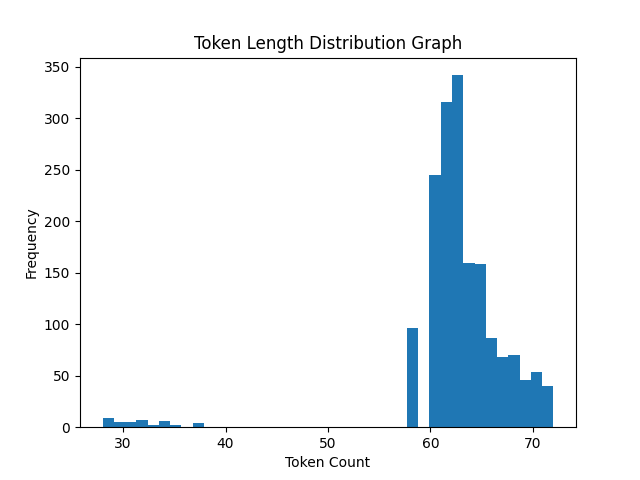

                                                Hestabit Training Development
                                                        Week 8 - Day 1

# Dataset Preparation and Analysis

## 1. Overview

This project focuses on preparing a high-quality instruction dataset intended for fine-tuning smaller language models. The dataset was generated, cleaned, analyzed, and structured through a systematic pipeline to ensure reliability and consistency before training.

Initially, **8100 samples** were generated. After applying several data-cleaning and filtering procedures, the final dataset contains **3425 high-quality samples** suitable for model training.

---

## 2. Data Cleaning Process

Several preprocessing steps were applied to improve the quality of the dataset and eliminate noise.

### Duplicate Removal

A large number of generated samples were duplicates caused by repeated template patterns. These were automatically detected and removed during the cleaning stage.

**Results:**

* Total Generated Samples: 8100
* Duplicates Removed: 4622
* Invalid Samples Removed: 0

After cleaning, **3478 unique samples** remained.

---

## 3. Token Length Analysis

To ensure consistency for model training, token length statistics were calculated across the dataset. Token lengths were measured using the tokenizer associated with the base model.

**Token Statistics:**

* Mean token length: ~49.7
* Median token length: 48
* Minimum tokens: 25
* Maximum tokens: 60

The distribution shows that most samples fall within a narrow range, indicating a consistent dataset structure.

A visualization of the distribution was generated and saved as:

```

```

---

## 4. Outlier Detection (IQR Method)

To further refine the dataset, statistical outlier detection was applied using the **Interquartile Range (IQR)** method. This approach helps identify samples with unusually short or long token sequences.

The following values were calculated:

* Q1 (25th percentile): 48
* Q3 (75th percentile): 52
* IQR: 4

From these values, the acceptable token range was determined:

* Lower bound: 42
* Upper bound: 58

Any samples outside this range were considered outliers and removed.

**Filtering Results:**

* Samples kept: 3425
* Samples removed: 53

This final filtering step ensured that the dataset maintains a consistent token length distribution.

---

## 5. Training & Validation Split

To prepare the dataset for model training and evaluation, it was divided into training and validation subsets.

The split ratio used is **80/20**.

| Dataset        | Number of Samples |
| -------------- | ----------------- |
| Training Set   | 2740              |
| Validation Set | 685               |
| **Total**      | **3425**          |

The training set will be used for model learning, while the validation set will help monitor performance during training.

---

## 6. Dataset Format

The dataset is stored in **JSONL (JSON Lines)** format, where each line contains one training sample.

Each entry follows a structured instruction format:

```
{
  "instruction": "...",
  "input": "...",
  "output": "..."
}
```

This format is commonly used for instruction-tuning tasks and works well with many modern language-model training pipelines.

---

## 7. Data Preparation Pipeline

The dataset was prepared through the following pipeline:

```
generate_dataset.py
        ↓
clean_dataset.py
        ↓
token_analysis.py
        ↓
remove_outliers_iqr.py
        ↓
split_dataset.py
```

Each stage progressively improved the dataset quality by removing duplicates, analyzing token lengths, filtering statistical outliers, and preparing training splits.

---

## 8. Summary

After completing the full preprocessing workflow:

* Final dataset size: **3425 samples**
* Training set: **2740 samples**
* Validation set: **685 samples**

The dataset now has consistent token lengths, minimal duplication, and a structured instruction format. These characteristics make it suitable for fine-tuning compact language models such as Phi-2 and TinyLlama.
