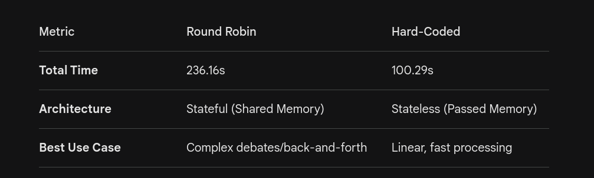
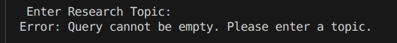
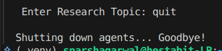
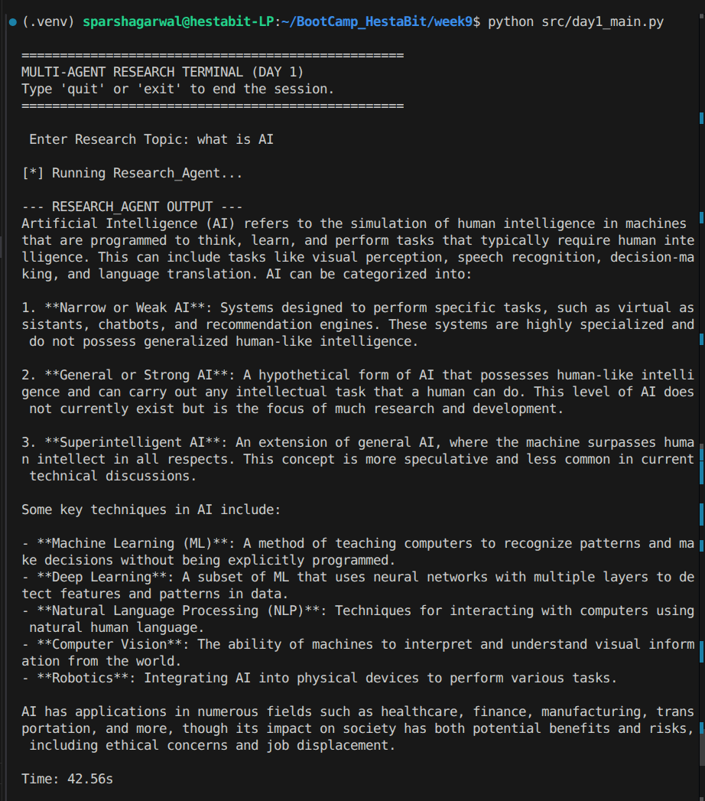
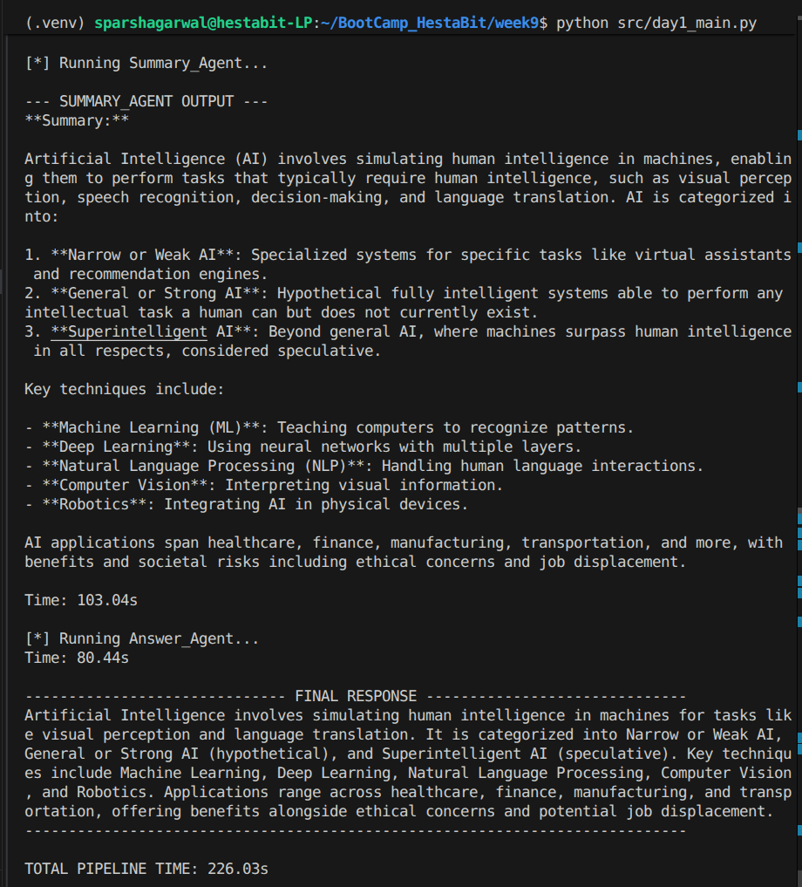

                            Hestabit Training Development
                                    Week 9 - Day 1

## 1. Overview
On Day 1, I set out to prove a personal theory: a single prompt, no matter how well-engineered, is never enough for high-stakes technical tasks. My goal wasn't just to get an LLM to explain Machine Learning; it was to build a **resilient, multi-stage assembly line** of AI experts. 

My core philosophy for this project is **Role Purity**. I forced each of my agents—the Researcher, the Summarizer, and the Answerer—to live in strict isolation. I wanted to eliminate the "cognitive bleed" that happens when one AI tries to be the librarian, the architect, and the editor all at once. By modularizing their brains, I ensured that my Researcher focuses strictly on raw data retrieval, while my Answerer obsesses over the user's final experience.

---

## 2. The Blueprint: My Architectural Logic
To get this running smoothly on my local hardware without the script crawling to a halt, I had to implement two specific architectural "secrets" that keep the system lean and mean:

### 2.1 The Sliding Window Strategy
I noticed early on that local LLMs like Qwen 2.5 are incredibly capable but get sluggish the moment you feed them a massive conversation history. To fix this, I implemented a `BufferedChatCompletionContext`. 

I set this up as a "moving spotlight" that only keeps the last **10 messages** in active memory. As the conversation moves forward, the oldest data simply drops off. This keeps my processing speed lightning-fast and, more importantly, prevents my local RAM from spiking during long research sessions.

### 2.2 My Strict Handoff Protocol
I deliberately chose a **Linear Pipeline** over a chaotic group chat. In a group chat, agents often "talk over" each other or get distracted by irrelevant context. By manually "catching" the Researcher's output in a buffer variable and "throwing" it to the Summarizer, I created a data firewall. The Summarizer *only* sees the facts found, not my original, potentially messy query. This ensures the final output is based on evidence, not just the model's imagination.

### Why I decided to use hard-coded approach instead of using Round Robin(creating teams)

---

## 3. The Implementation Journey: Trial by Error
My code didn't start out this polished; it evolved through some pretty intense real-world debugging:

* **The Validation Wall:** I initially hit a frustrating `ValueError` because AutoGen v0.7.5 is incredibly strict about `ModelInfo`. I spent a good chunk of time realizing I had to explicitly tell the framework exactly what my local model could do—manually setting things like `json_output` and `vision` to `False` just to satisfy the new strict validation logic.
* **My "Human-in-the-Loop" Terminal:** I wanted a tool I could actually use, so I built a persistent terminal that handles "quit" and "exit" commands naturally. I also added **Guard Clauses** to check for empty inputs. This might seem small, but it saves me from wasting a full minute of GPU time if I accidentally hit "Enter" or make a typo.

---

## 4. My Benchmark Test: "The 175-Second Milestone"
I put my pipeline to the test with a heavy-hitter query: **"What is ML?"** The results gave me a fascinating look at how my local AI actually "thinks" and where the real computational bottlenecks are hiding.

### My Performance Breakdown
| Station | Time | My Analysis |
| :--- | :--- | :--- |
| **Researcher** | 53.96s | The heavy lifter: scouring internal weights for raw technical facts. |
| **Summarizer** | **75.82s** | **The Bottleneck:** Interestingly, I found that condensing large text is more intense for local inference than finding the data itself. |
| **Answerer** | 41.88s | The "Sprinting" phase: formatting clean text is relatively light work for my setup. |
| **TOTAL PIPELINE** | **175.33s** | **Total time from a blank screen to a professional, multi-layered report.** |

---

## 5. Visual Evidence of My Progress
*These screenshots document the live behavior of the system during my final integration tests.*

### 5.1 My Terminal UI & Loop
This shows the persistent loop in action, gracefully handling inputs and waiting for my next command.

#### In-Case Empty Query

#### In-Case Exit Query

### 5.2 My Real-Time Agent Handoffs
I'm particularly proud of this "Transparency Mode." You can see exactly what the Researcher found before the Summarizer even touches it. It makes debugging a breeze.

### 5.3 My Final Performance Summary
This is the raw output of my timing logic. It proves that my "sliding window" approach keeps the system from slowing down as the session grows.

---