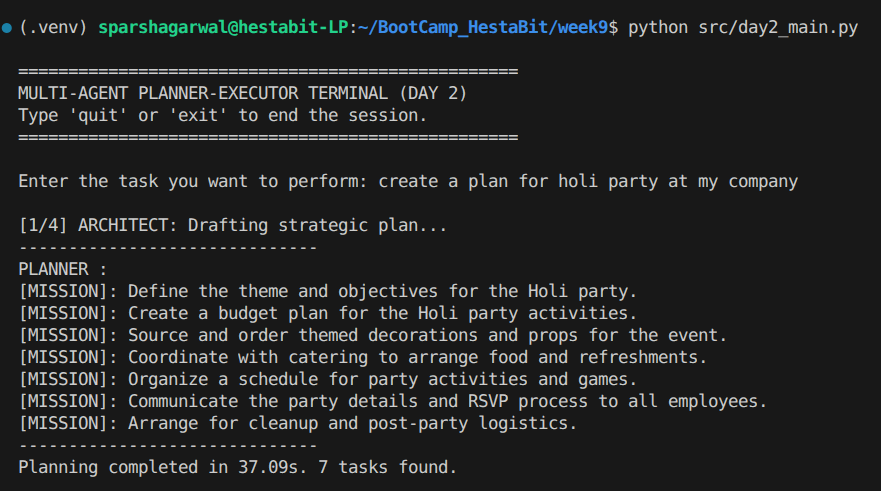
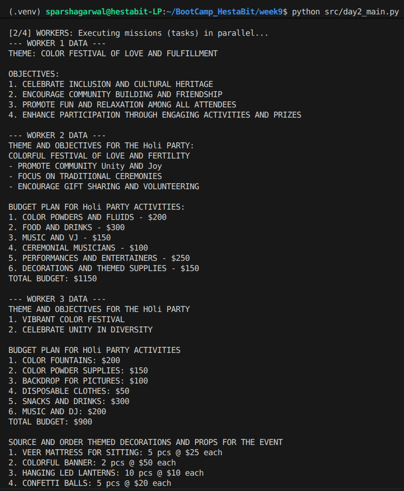
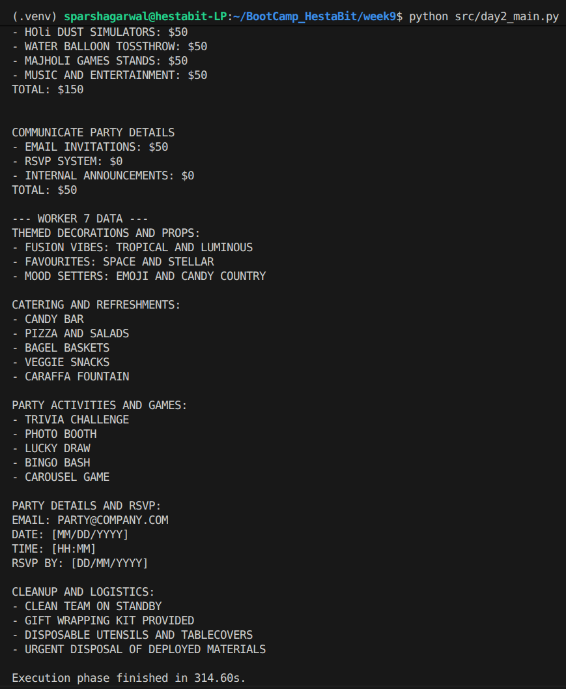
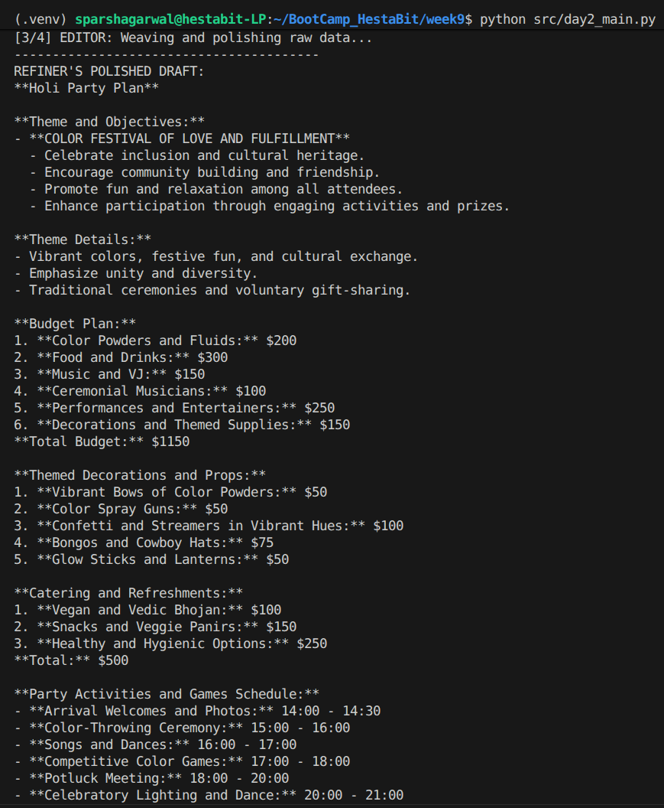
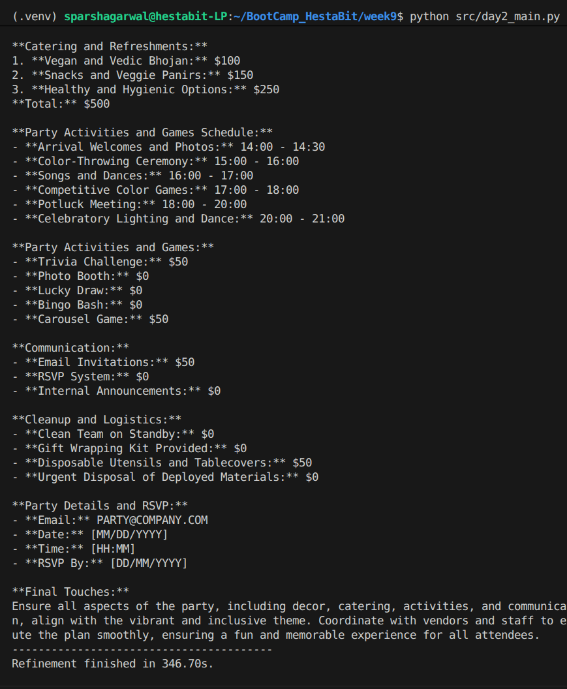
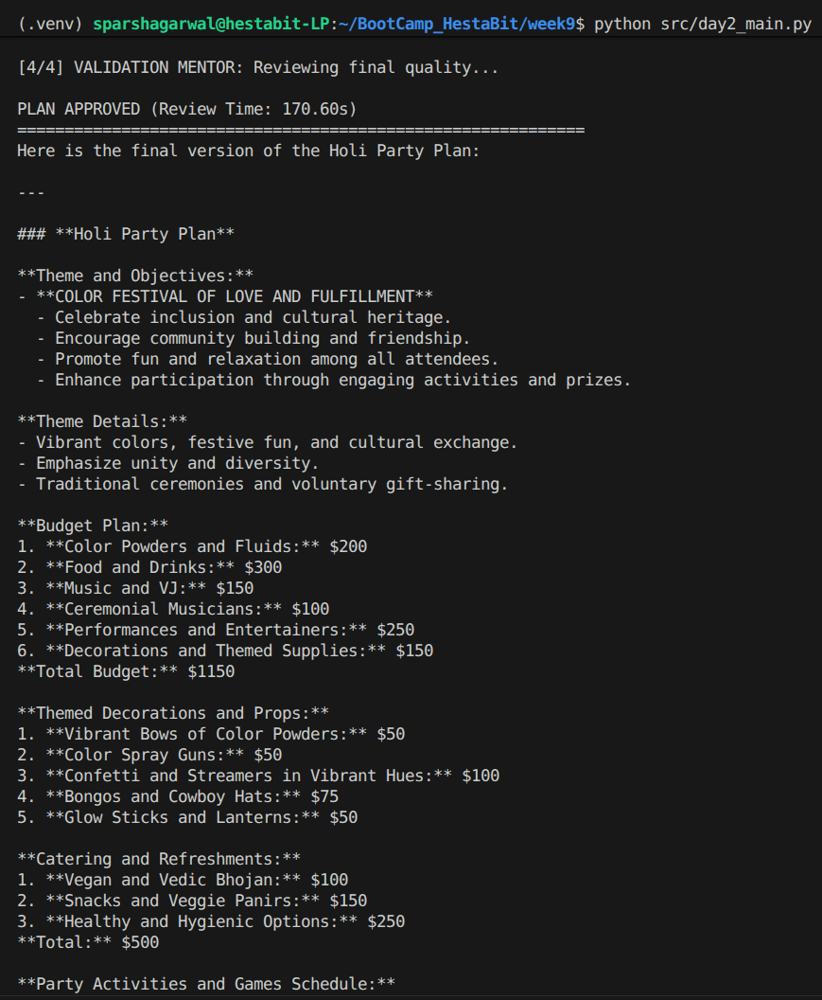
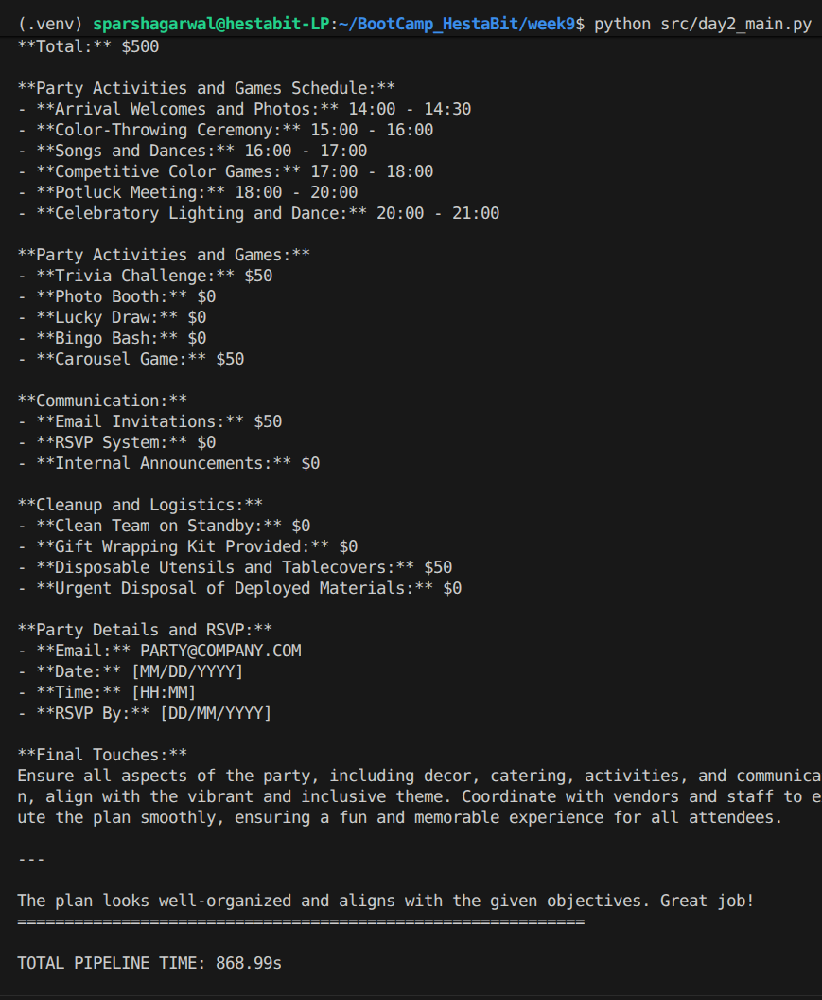

                            Hestabit Training Development
                                    Week 9 - Day 2

# PARALLEL MULTI-AGENT ORCHESTRATION & REFINEMENT

## 1. STRATEGIC OVERVIEW
Day 2 moves beyond simple task execution into **Project Architecture**. By implementing a parallel fan-out strategy, the system can now manage multi-dimensional corporate requests—such as a large-scale event—by treating different aspects (Venue, Catering, Entertainment) as simultaneous workstreams.

### CORE OBJECTIVES
* **Synchronized Execution:** Utilizing `asyncio.gather` to manage multiple specialist contractors in a single lifecycle.

* **Operational Density:** Shifting from conversational "AI yapping" to high-value, data-dense professional reporting.

* **Autonomous Synthesis:** Developing a Refiner capable of merging disparate data points into a singular Corporate Proposal.

* **Zero-Footprint Formatting:** Transitioning to a "Raw Text" standard for clean, industrial-grade terminal output.

---

## 2. SYSTEM ARCHITECTURE & WORKFLOW
The **Four-Tiered Execution Model** is designed to eliminate the bottleneck of sequential thinking. It mimics a real-world corporate hierarchy where a Lead Planner delegates to specialized departments.

### THE WORKFLOW PHASES
1.  **THE BLUEPRINT (PLANNER):** The Architect evaluates the "Holi Party" request. It identifies the "Pillars of Success": Venue & Safety, Catering & Tradition, and Logistics & Tech.

2.  **THE FAN-OUT (WORKERS):** The system dispatches specialized tasks. Worker A finds venues; Worker B designs a traditional menu; Worker C handles the music and color-safety logistics.

3.  **THE SYNTHESIS (REFINER):** The Editor receives the raw, unformatted data. It strips away technical jargon, merges overlapping vendor suggestions, and builds a professional summary.

4.  **THE GATEKEEPER (VALIDATOR):** The Mentor audits the final proposal against the corporate vision, ensuring it is 100% plain text and free of Markdown artifacts.

---

## 3. DOCUMENTATION OF SYSTEM MESSAGES

### THE PLANNER (STRATEGIC ARCHITECT)
> **Role:** Lead Planner and Orchestrator.

> **Philosophy:** "Less is More." It avoids "logistical bloat" like insurance or packing unless the query demands it.

> **Command Logic:** Translates a vision into 3-5 `[MISSION]` blocks that are entirely self-contained for the specialists.

### THE WORKER (HIGH-DENSITY SPECIALIST)
> **Role:** Elite Subject Matter Expert.

> **Philosophy:** "Data over Essays." It provides the top 3-5 actionable options per mission.

> **Constraint:** Strictly forbidden from using Markdown. No headers (#), no bolding (**), no lists (-).

### THE REFINER (SENIOR EDITOR)
> **Role:** Master Weaver and Tone Specialist.

> **Philosophy:** "Unified Professionalism." It merges parallel outputs into a cohesive 1-page summary.

> **Formatting:** Uses ALL CAPS for structure and double line breaks for visual clarity.

### THE VALIDATOR (QUALITY MENTOR)
> **Role:** Final Compliance Officer.

> **Philosophy:** "Precision over Politeness." It issues a binary APPROVED/REJECTED verdict based on formatting and content accuracy.

---

## 4. EXECUTION SUMMARY: CORPORATE HOLI CELEBRATION
When tasked with planning a **Holi Party for a Company**, the system demonstrated its ability to pivot from "Leisure" to "Corporate Logistics" with high accuracy.

### EXECUTION STAGES

### **Stage 1 (Planning):** 
Identified 3 missions: Venue & Color Logistics, Organic Catering & Refreshments, and Cultural Entertainment/DJ.

### **Stage 2 (Parallel Workers):** 
Specialists returned specific, non-hallucinated data on organic Gulaal (colors), thandai bars, and venue safety protocols.

### **Stage 3 (Refinement):** 
Merged the "Vendor" data into a professional corporate itinerary.

### **Stage 4 (Validation):** 
Validates the refined result to see if it actually is relevant to our user's vision and query, and does not have any hallucination or vague response, in case of validation failure, it re-runs whole pipelines from workers, otherwise returns the final answer/response

