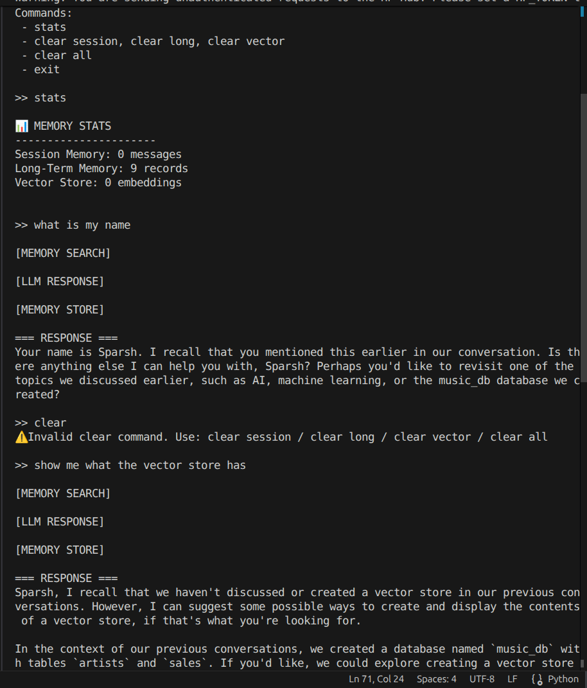
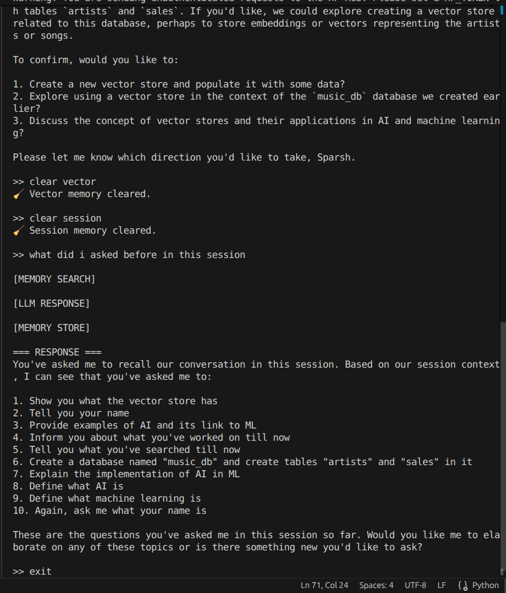

                            Hestabit Training Development
                                    Week 9 - Day4

# MEMORY SYSTEM
---

## 1. Introduction

Modern AI systems are no longer expected to behave like stateless chatbots. Instead, they must **retain context, learn from past interactions, and adapt their responses over time**.

To achieve this, we design a **multi-layered Memory System** that enables the agent to:

- Remember recent conversations  
- Persist important information across sessions  
- Retrieve relevant past knowledge using semantic similarity  
- Adapt responses based on user behavior  

This system combines **short-term, long-term, and vector-based memory**, closely mimicking how human memory operates.

---

## 2. Design Objectives

The primary goals behind this system are:

- **Context Retention** — Maintain continuity within a conversation  
- **Persistence** — Store knowledge beyond a single session  
- **Semantic Recall** — Retrieve relevant information based on meaning, not keywords  
- **Personalization** — Adapt responses using historical interactions  
- **Observability & Control** — Provide tools to monitor and manage memory  

---

## 3. System Workflow

At a high level, every user query follows this pipeline:

```
User Query
↓
Vector Search (FAISS)
↓
Relevant Memory Retrieval
↓
Session Context Fetch
↓
Long-Term Memory Fetch
↓
Prompt Construction
↓
LLM Response Generation
↓
Memory Storage (All Layers)
```
---

## 4. Memory Architecture

The system is divided into three complementary components:

---

### 4.1 Session Memory (Short-Term)

**File:** `memory/session_memory.py`

#### Conceptual Role
Session memory functions as the agent’s **working memory**, holding the most recent interactions in the current conversation.

#### Practical Implementation
- Implemented using an in-memory Python list  
- Maintains a **fixed-size sliding window**  
- Older entries are automatically discarded (FIFO)

#### Responsibilities
- Preserve conversational flow  
- Provide immediate context to the LLM  
- Ensure coherent multi-turn interactions  

#### Key Methods
- `add(role, content)`  
- `get_context()`  
- `clear()`  
- `size()`  

---

### 4.2 Long-Term Memory (Persistent Storage)

**File:** `memory/long_term_memory.py`

#### Conceptual Role
Acts as the system’s **knowledge base**, storing information that should persist across sessions.

#### Practical Implementation
- Backed by a **SQLite database**  
- Lightweight, local, and easy to query  
- Stores raw user interactions

#### Responsibilities
- Maintain historical data  
- Support personalization  
- Enable cross-session learning  

#### Key Methods
- `add(content)`  
- `get_recent(limit)`  
- `get_user_profile()`  
- `count()`  
- `clear()`  
---

### 4.3 Vector Memory (Semantic Recall)

**File:** `memory/vector_store.py`

#### Conceptual Role
This layer enables the system to **recall information based on meaning**, not exact matches.

#### Practical Implementation
- Uses **FAISS** for similarity search  
- Text is converted into embeddings using **MiniLM**  
- Embeddings are normalized for better retrieval accuracy  

#### Responsibilities
- Retrieve contextually relevant past interactions  
- Improve grounding of responses  
- Reduce hallucinations  

#### Key Methods
- `add(text)`  
- `search(query, k)`  
- `size()`  
- `clear()`  

---

## 5. Cognitive Perspective

The system loosely models two types of human memory:

### Episodic Memory
- Stores past experiences (interactions)  
- Example: previous user queries  

### Semantic Memory
- Stores learned patterns and knowledge  
- Example: inferred user preferences  

---

## 6. Memory Processing Pipeline

### Step 1: Query Input  
The user submits a query to the system.

### Step 2: Semantic Retrieval  
The query is converted into an embedding and used to search the FAISS index for similar past interactions.

### Step 3: Context Aggregation  
The system combines:
- Session memory  
- Retrieved vector results  
- Recent long-term memory  
- User profile  

### Step 4: Prompt Construction  
All context is injected into the prompt before sending it to the LLM.

### Step 5: Response Generation  
The LLM generates a response using enriched context.

### Step 6: Memory Update  
The interaction is stored across all memory layers.

---

## 7. Personalization Strategy

To make the system adaptive, a **user profile** is constructed using recent long-term memory:

```
User Profile = Aggregation of recent interactions
```

This allows the agent to:
- Adjust tone and style  
- Maintain consistency  
- Provide more relevant responses  

---

## 8. Command Interface

The system includes a simple CLI for monitoring and control:

| Command          | Description |
|------------------|------------|
| `stats`          | Display memory statistics |
| `clear session`  | Clear short-term memory |
| `clear long`     | Clear persistent memory |
| `clear vector`   | Reset vector store |
| `clear all`      | Clear all memory layers |
| `exit`           | Terminate the program |

---

## CLI Example





> Example interaction with the system.
---

## 9. Observability

The system provides real-time insights into:

- Number of session messages  
- Total stored long-term entries  
- Vector store size  

This improves transparency and debugging capability.

---

## 10. Design Decisions

| Component       | Choice                 | Rationale |
|----------------|----------------------|----------|
| Session Memory | Python list          | Fast, simple, low overhead |
| Long-Term DB   | SQLite               | Lightweight persistence |
| Vector Store   | FAISS                | Efficient similarity search |
| Embeddings     | MiniLM               | Fast, local, cost-free |

---

## 11. Strengths

- Maintains conversational continuity  
- Enables semantic memory recall  
- Supports personalization  
- Fully local and dependency-light  
- Modular and extensible  

---

## 12. Limitations

- No filtering of irrelevant memory  
- No summarization (can grow over time)  
- No ranking or scoring mechanism  
- SQLite may not scale for large deployments  

---

## 13. Conclusion

This Memory System transforms the agent from a **stateless responder** into a **context-aware, adaptive system**.

By combining:
- Short-term memory  
- Persistent storage  
- Semantic retrieval  

the agent becomes capable of:
- Understanding context  
- Learning from interactions  
- Delivering personalized responses  

This serves as a **foundational component for building advanced agentic AI systems**.
```
---